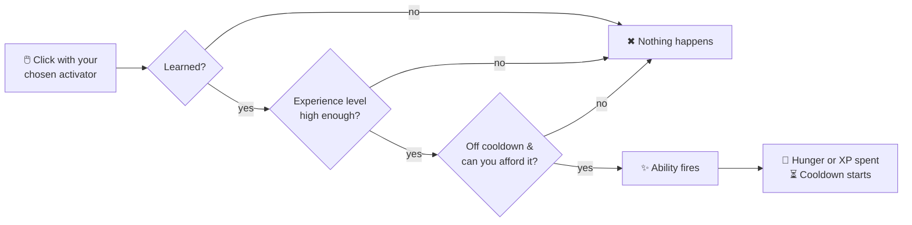

# Active HMs

Active HMs are fired on demand: pick one in the [HM wheel](../hm-wheel.md), then click with an
empty hand or the HM Case. Each use costs **hunger or experience** — whichever the server asks for —
and most start a cooldown.

---

## Acquisition table

Any one of the listed Pokémon can teach the HM. Hold the trigger item and **sneak + right-click** the Pokémon.

| Disc | HM | Pokémon (any of) | Trigger item |
|---|---|---|---|
|  | Barrier | Mr. Mime, Scream Tail, Hatterene | Glass Pane |
|  | Blizzard | Abomasnow, Glalie, Froslass | Snowball |
|  | Boomerang | Cubone, Marowak, Houndoom | Bone |
|  | Bullet Seed | Seedot, Nuzleaf, Cacnea | Wheat Seeds |
|  | Camouflage | Zorua, Kecleon, Ditto | Ink Sac |
|  | Celebrate | Jigglypuff, Ludicolo, Alcremie | Firework Rocket |
|  | Charge | Elekid, Electabuzz, Electivire | Redstone Dust |
|  | Charm | Jynx, Sylveon, Clefable | Pink Tulip |
|  | Confusion | Psyduck, Golduck, Hypno | Amethyst Cluster |
|  | Crabhammer | Kingler, Clawitzer | Mace |
|  | Cut | Scyther, Scizor, Kartana | Stick |
|  | Decorate | Sylveon, Milcery, Togekiss | Painting |
|  | Defog | Togekiss, Mantine, Pelipper | Glass |
|  | Destiny Bond | Misdreavus, Duskull, Shuppet | Echo Shard |
|  | Dig | Diglett, Dugtrio, Trapinch | Diamond Shovel |
|  | Earthquake | Donphan, Rhydon, Gigalith | Deepslate |
|  | Egg Bomb | Chansey, Blissey, Exeggutor | Egg |
|  | Ember | Charmander, Torchic, Tepig | Blaze Powder |
|  | Eruption | Camerupt, Magcargo, Heatran | Magma Block |
|  | Explosion | Voltorb, Electrode | TNT |
|  | Fly | Pidgeot, Charizard, Dragonite | Phantom Membrane |
|  | Headbutt | Cranidos, Rampardos, Cubone | Iron Helmet |
|  | Leafage | Bulbasaur, Chikorita, Treecko, Snivy | Dandelion |
|  | Miracle Eye | Xatu, Sigilyph, Unown | Eye of Ender |
|  | Obstruct | Obstagoon, Perrserker, Bisharp | Iron Bars |
|  | Present | Delibird, Stantler, Spinda | Paper |
|  | Protect | Shuckle, Wobbuffet, Cloyster | Turtle Shell |
|  | Rain Dance | Politoed, Kyogre, Golduck | Prismarine Crystals |
|  | Rest | Snorlax, Komala, Jigglypuff | Apple |
|  | Revival Blessing | Rabsca | Totem of Undying |
|  | Rock Smash | Hitmonchan, Machop, Geodude | Flint |
|  | Rock Throw | Geodude, Onix, Nosepass | Cobblestone |
|  | Rototiller | Drilbur, Excadrill | Coarse Dirt |
|  | Stockpile | Gulpin, Swalot | Sponge |
|  | Strength | Machoke, Machamp, Conkeldurr | Iron Ingot |
|  | String Shot | Caterpie, Spinarak, Ariados | String |
|  | Substitute | Wobbuffet, Mew, Smeargle | Armor Stand |
|  | Sunny Day | Torkoal, Sunkern, Volcarona | Sunflower |
|  | Sweet Scent | Gloom, Bellossom, Vileplume, Aromatisse | Lilac |
|  | Tail Whip | Rattata, Sentret, Buneary | Brush |
|  | Teleport | Abra, Kadabra, Alakazam, Ralts | Ender Pearl |
|  | Thief | Meowth, Purrloin, Sableye | Tripwire Hook |
|  | Thunder | Pikachu, Raichu, Zapdos | Lightning Rod |
|  | Water Gun | Squirtle, Totodile, Mudkip | Blue Dye |
|  | Waterfall | Gyarados, Ludicolo, Feraligatr | Prismarine Shard |
|  | Whirlwind | Pidgeot, Fearow, Swellow | Wind Charge |
|  | X-Scissor | Scyther, Kleavor, Vikavolt | Iron Sword |

---

## Ability details

###  Barrier
**Hunger:** 3 · **Cooldown:** 15s · **Power:** how long the wall stands

Raises a **3×3 wall you cannot see** directly in front of you. An arrow stops in mid-air; a creeper
walks into nothing.

It fills **empty space only**, and when it comes down it removes only what it put there — so it can
never take a bite out of somebody's house, and never leaves a hole where one was not.

---

###  Blizzard
**Hunger:** 6 · **Cooldown:** 30s · **Power:** radius

**It snows.** Flakes fall inside the area and snow settles on the ground a layer at a time — the
same block a real snowfall leaves — **whatever the biome**. Call one down in a desert and it snows
in the desert.

The biome is never touched to do it: the weather is simulated where it stands, because asking
vanilla for snow in a warm biome means rewriting that biome permanently, which is not something a
click should do to somebody's world.

And it **melts on its own**. The snow obeys the world's own light and temperature rules from the
moment it lands, so a blizzard in a taiga stays and a blizzard in a desert is gone by morning.
Leaving that to vanilla is what keeps this from being a landscaping tool.

---

###  Boomerang
**Hunger:** 1 · **Cooldown:** 1s · **Power:** tenths of a half-heart of damage

Throws a **bone** that flies out flat, turns, and comes back to your hand. Hit something and it
stops there instead, on the ground beside it — so a clean miss costs you nothing and a hit costs you
the walk over to fetch it.

---

###  Bullet Seed
**Hunger:** 2 · **Cooldown:** 1s · **Power:** 5 seeds per burst

Fires a rapid barrage of seed projectiles, consuming any `"seed"` items from your inventory. They
render as the seed you fired, fly flat and fast, and hurt what they land on — **power** sets both how
many go out and how hard each one lands.

---

###  Camouflage
**Hunger:** 3 · **Cooldown:** 15 min · **Power:** 18000t (**15 minutes**)

Become the **living creature** you're looking at. Your model is replaced by theirs — species, form,
variant, gear and its nametag — for everyone who can see you.

- Aim at a **creature** in clear view → you look exactly like it for 15 minutes.
- **Fire it again while you are wearing one** → the costume comes off and the HM is ready
  immediately, so changing disguise is two presses.
- A block, a wall between you and it, or empty air → nothing happens. You can only copy something
  you can actually see.
- Other **players** can't be copied.

The disguise is a costume, not a creature: nothing extra exists in the world, so there is nothing
to hit, nothing in your way, and nothing that can be killed off you.

---

###  Celebrate
**Hunger:** 1 · **Cooldown:** 10 min · **Power:** how many rockets

A firework show over your head, for no reason at all. It does nothing, which is the point — and why
it costs almost no hunger and comes back only once every ten minutes. A party you can throw every
few seconds is a particle effect; one you get a few times an evening is an occasion.

---

###  Charge
**Hunger:** 2 · **Cooldown:** 3s · **Power:** 200t (**10 seconds**)

Turns the block you aim at into a redstone power source — enough to throw a door, a piston or a
lamp from across a room. **It does not run out.** The charge ends when you charge something else or
leave, and never on a timer: a power source that switches itself off after a minute is not a power
source, it is a fault to go and find.

The block is never replaced — it stays exactly what it is and simply *answers* as a power source —
so you can charge a chest, a furnace, a statue or a wall without losing anything. While it is live
it throws off **electric sparks**, so a charged block is one you can find again.

---

###  Charm
**Hunger:** 2 · **Cooldown:** 3s · **Power:** 2400t (**2 minutes**)

Aim at a mob and use it — that mob becomes **charmed** and follows you around for 2 minutes (it paths toward you when more than ~3 blocks away). Great for relocating a stubborn animal or keeping an ally close.

---

###  Confusion
**Hunger:** 3 · **Cooldown:** 10s · **Power:** how long it lasts (default **200t**, 10 seconds)

Turns the target around inside its own head. What that means depends on what you hit, because its
victims are not the same kind of thing.

- **A player** loses which way is forward. **W** walks them backwards, **A** and **D** swap, and the
  camera inverts on both axes. It reaches everything they do — walking, swimming, flying and riding
  all read the same inverted intention.
- **Anything else** has no keys to invert, so it loses the thread instead: it forgets what it was
  chasing and blunders off somewhere.

Pretending a zombie has a W key would have been the wrong translation, and leaving mobs out would
have made this an HM that does nothing at all in single player.

---

###  Crabhammer
**Hunger:** 3 · **Cooldown:** 2s

A heavy mace swing: deals strong damage and knocks back all enemies within 3 blocks in front of you.

---

###  Cut
**Hunger:** 2 · **Cooldown:** none · **Power:** max 128 blocks

Aim at a **log** and the whole tree comes down — every connected log, with the leaves and vines
tangled in it. Aim at a **leaf** or a **vine** and just that tangle goes.

It also **cuts plants**: grass, ferns, crops, ground cover. Those come away as if you had used
shears, so the drops are the careful ones — the grass itself rather than a couple of seeds — and
that holds for plants added by a datapack too, because it is the game's own loot tables answering.

Felling a tree and cutting a plant both cost hunger. A single isolated log, and shearing a sheep,
are free.

---

###  Decorate
**Hunger:** 4 · **Cooldown:** 1 min · **Power:** radius

Two different things depending on what you point it at.

**At the ground** — carpets across the area, all one colour, rolled fresh every cast, and whatever
art fits hung on the walls in reach.

**At a Pokémon** — a single long shot at making it **shiny, permanently**, at the game's own shiny
odds. It is not a shiny generator: it is the same lottery everybody else plays, offered once per
cast on a long cooldown, and it says nothing when it misses because the game says nothing either.

---

###  Defog
**Hunger:** 2 · **Cooldown:** 5s · **Power:** 10

Cures **your own negative status effects** (poison, wither, blindness, slowness, mining fatigue, weakness, hunger, unluck, levitation), leaving you fresh.

---

###  Destiny Bond
**Hunger:** 4 · **Cooldown:** 30s · **Power:** 200t (**10 seconds**)

**Aim at a creature to tie yourself to it.** For a short window after that, however you die — a
mob, a fall, lava, your own Explosion — it dies too, wherever it happens to be standing.

You choose who you are taking with you, and then you have to be right. Other players cannot be
bound.

---

###  Dig
**Hunger:** 2 · **Cooldown:** none

Instantly breaks the shovel-minable block you're aiming at (Netherite Shovel drops).

---

###  Earthquake
**Hunger:** 4 · **Cooldown:** 10s · **Power:** radius

Shakes the ground out of true around you: some of the surface rises a block, some of it is simply
gone, most of it stays. The result is not a crater — it is ground nobody can path across cleanly,
which is worse to be chased over.

It will not move anything with something **inside** it, and nothing tougher than stone, so chests
keep their contents and built floors stay built.

---

###  Egg Bomb
**Hunger:** 2 · **Cooldown:** 3s · **Power:** blast strength ×10 (10 = 1.0)

Lobs a single heavy **egg**, taken from your own supply, that bursts where it lands. The blast is
deliberately small — a strength of 1, against a creeper's 3 — so it scatters what is standing there
and takes a bite out of soft ground without opening a hole.

---

###  Ember
**Hunger:** 1 · **Cooldown:** 1s · **Power:** reach 5 blocks

Works like **Flint & Steel** — places fire, primes TNT, and ignites entities in front of you.

---

###  Eruption
**Hunger:** 5 · **Cooldown:** 10s · **Power:** reach in blocks (default 5)

Opens a pool of lava **on the face of the block you are aiming at** — the same square a bucket would
fill, never underfoot. It refuses if you are close enough to be standing in it.

It has to pass the same permission check a lava bucket does, so claims, spawn protection and the
world border all hold: a plot you cannot build in is a plot you cannot erupt in.

---

###  Explosion
**Hunger:** 15 · **Cooldown:** 10s · **Power:** 4 (blast radius)

A large explosion centred on you. **Nine times out of ten it kills you outright** — the tenth
leaves you standing on a single heart.

It is not a tool with a downside. It is the last thing you do, and one time in ten it is not.

---

###  Fly
**Hunger:** 3 · **Cooldown:** 1s · **Power:** 1200t

Launches you skyward and engages **Glide** — ride the skies like a Charizard. Re-use it in the
air for a firework-style boost.

!!! note "Requires Glide"
    You must have **learned Glide** to use Fly. Using Fly automatically turns the Glide toggle on.
    It does **not** give or equip an Elytra item.

---

###  Headbutt
**Hunger:** 2 · **Cooldown:** 2s · **Power:** drives the hop, the damage and the recoil

Hurls you forward head-first, **from standing** — you need both feet on the ground to throw
yourself anywhere.

- Into a **tree**, the branches shake loose. Sticks from any tree, and the sapling that grows that
  particular wood. **Apples — and the Applin that grew inside one — only fall out of apple trees**;
  shaking a spruce gets you spruce things.
- One shake in sixty turns out to have had a **Greedent** in it, whatever the tree, and it does not
  enjoy being woken up.
- A **hive** in the tree comes out after you, exactly as it would if you had broken into it.
- Into a **creature**, it hurts them.
- Either way it hurts you. That's the joke.

Only the first impact of each charge counts, so wedging yourself against a trunk can't chew through
your health bar.

---

###  Leafage
**Hunger:** 1 · **Cooldown:** 2s · **Power:** radius 5

Instantly grows **every crop around you** to full maturity — handy for fast harvests — and does
the same for saplings and berry trees.

The bare ground answers too, and it answers in **flowers**: a burst leaves a meadow rather than a
lawn, with the odd blade of grass among it. The blooms are ones that belong to the biome you are
standing in, so a burst in a plains looks nothing like one in a flower forest — and a biome with no
flowers of its own gets grass rather than a dandelion that does not belong there.

It only ever plants on **bare ground**. A spot that already has something growing on it is left
exactly as it stands, so casting twice in the same meadow thickens it instead of disturbing it, and
tall flowers are planted whole rather than as a half that topples.

---

###  Miracle Eye
**Hunger:** 5 · **Cooldown:** 30s · **Power:** search radius in chunks (default 100)

Throws an eye that flies off towards the nearest **legendary monument** — exactly the way an Eye of
Ender leads you to a stronghold. Follow it, throw another when it fades, and keep going. It tells
you nothing in words: not the name, not the distance, not a bearing and certainly not coordinates.
Walking there is the point. The eye leaves nothing behind when it fades.

Which monuments it knows about is a **datapack tag**, `cobblemon_ditto_hms:miracle_eye`. It ships
pointing at the thirteen from [Legendary Monuments](https://modrinth.com/mod/legendary-monuments),
each listed as optional — so a world without that mod loads perfectly well and Miracle Eye simply
reports that there is nothing out there. Override the tag in a datapack to point it anywhere else.

---

###  Obstruct
**Hunger:** 3 · **Cooldown:** 1 min · **Power:** how long the seal holds (default **6000t**, 5 minutes)

Seals the container you are aiming at. Nobody opens it while the seal lasts — and **its own hoppers
stop working too**, in both directions.

That second half is what makes it a seal rather than a lock. A chest with a hopper under it is a
chest with a hole in the bottom, so stopping the lid and leaving the hopper draining would look like
protection without being any. A hopper pointing at a sealed container simply idles, the same way one
pointing at nothing does, and picks up again when the seal expires.

---

###  Present
**Hunger:** 12 · **Cooldown:** 20 min

Point it at an **empty** container and it fills itself, out of the loot tables the game uses for the
chests nobody placed on purpose — a mineshaft's, a dungeon's, a bonus chest — one of them rolled at
random.

**One in ten is a lump of coal.** That is the joke, and it is why the cooldown is a full Minecraft
day. It refuses a container with anything already in it: a present does not go on top of your
things.

---

###  Protect
**Hunger:** 1 · **Cooldown:** 10s · **Power:** ticks of immunity (20 = 1s)

**Nothing can touch you for one second.** Falls, drowning, lava, the void, a hit that would
otherwise be unblockable — all of it. Then nothing again for ten seconds.

It is not a shield you stand behind, it is a **read**: you spend it on the creeper you heard or the
arrow you saw leave the bow, and if you spend it a moment early you have nothing left when the blow
actually lands.

---

###  Rain Dance
**Hunger:** 5 · **Cooldown:** 10s · **Power:** 6000t (5 min)

Summons **rain** on the overworld.

---

###  Rest
**Hunger:** 0 · **Cooldown:** 10 min

Restores your **full HP**, clears your status effects, and **skips the night** (like sleeping).
Leaves you hungry afterwards, and says nothing at all while it does it.

!!! warning "Multiplayer"
    In multiplayer, **all online players must agree** to rest within a short window.

---

###  Revival Blessing
**Hunger:** 1 · **Cooldown:** 20 min

Fully heals and **revives every Pokémon in your party** — clears faints and status. Drains **all** your hunger as the cost.

---

###  Rock Smash
**Hunger:** 2 · **Cooldown:** none · **Power:** max 32 ores

Instantly breaks the block you aim at. If it's an **ore**, vein-mines all connected ore of that type; otherwise breaks the single pickaxe-minable block (Netherite Pickaxe drops).

---

###  Rock Throw
**Hunger:** 1 · **Cooldown:** 1s · **Power:** tenths of a half-heart of damage

Throws a stone out of your pockets — cobblestone, blackstone, deepslate, any base stone. It hurts
what it hits, and if it hits nothing it **lands as a stone**, including somewhere you could never
have reached to place one. Ammunition you can pick back up is ammunition you can afford to miss
with.

---

###  Rototiller
**Hunger:** 1 · **Cooldown:** none

Tills the dirt-type block you're aiming at into Farmland (Dirt, Grass Block, Coarse Dirt, Dirt Path).

---

###  Stockpile
**Hunger:** 1 · **Cooldown:** 1s · **Power:** lava self-damage 2

Drinks up the **water or lava** block you aim at (source or flowing) — handy for draining pools or
clearing a path. Water is free; **lava is spicy** and singes you for a little health each gulp.

---

###  Strength
**Hunger:** 2 · **Cooldown:** none

Pushes the aimed block one block in whichever of the six directions you're looking — up and down
included. Containers travel with their contents, and a **double chest moves as one unit**: both
halves go together, or the push fails if either has nowhere to go. Won't move fluids.

---

###  String Shot
**Hunger:** 1 · **Cooldown:** 2s · **Power:** radius 1

Two different tools, and **what you were already doing decides which you meant**.

- **On the move** — two cobwebs go up directly behind you, foot and head height, and they are
  gone in a second. An escape: something to leave in a doorway you have just come through.
- **Standing still** — one web goes exactly where you are **aiming**, and it **stays**. A trap
  you set on purpose, or something to break a fall at the bottom of a shaft.

---

###  Substitute
**Hunger:** 4 · **Cooldown:** 20s · **Power:** 2400t (**2 minutes**)

Leaves a decoy of you standing where you were — **wearing your name** and walking off under its own
steam — and **turns you invisible for two seconds** so you can be somewhere else by the time
anything looks up. Cast it at a run and the decoy carries your momentum off in roughly your
direction; cast it standing and it picks a bearing of its own. It steps over anything knee-high in
its way. Hostile creatures already hunting you switch to
the decoy while it stands, so it buys you a way out of a fight. Casting it again replaces the decoy
rather than adding a second.

---

###  Sunny Day
**Hunger:** 5 · **Cooldown:** 10s · **Power:** 6000t (5 min)

Clears the weather to **sunny**.

---

###  Sweet Scent
**Hunger:** 6 · **Cooldown:** 90s · **Power:** 5 (how many turn up)

Draws a horde of wild Pokémon out of hiding all around you. Legendaries, mythicals, Ultra Beasts and
Paradox Pokémon never answer — a crowd you can summon on a cooldown would otherwise be a farm.

---

###  Tail Whip
**Hunger:** 2 · **Cooldown:** 2s

Sweeps a **suspicious sand or gravel** block clean in a single motion instead of a dozen slow ones,
and finds exactly what a brush would have found. **Rooted dirt** counts too: it is not brushable in
vanilla, but it is the same gesture on the same kind of thing, so it gives up its hanging roots.

---

###  Teleport
**Hunger:** 5 · **Cooldown:** 5s · **Power:** max 30 blocks

Blinks you to the block you're looking at (≤ 30 blocks), finding the nearest safe landing. Plays the Enderman teleport sound.

---

###  Thief
**Hunger:** 2 · **Cooldown:** 5s

Takes whatever the creature in your crosshair is holding in its main hand and puts it in your
inventory. Armour stays on. A creature with empty hands simply says so.

---

###  Thunder
**Hunger:** 3 · **Cooldown:** 5s · **Power:** 3 bolts

Calls down 3 lightning bolts around your position.

---

###  Water Gun
**Hunger:** 1 · **Cooldown:** 2s · **Power:** radius 3

Fires in the direction you're looking — extinguishes fire, wets sponges, and places a water block on the aimed surface.

---

###  Waterfall
**Hunger:** 2 · **Cooldown:** 6s · **Power:** 40t

**While in water**, rides a strong upward current toward the surface. Must be in water to use.

---

###  Whirlwind
**Hunger:** 2 · **Cooldown:** 5s · **Power:** percent of the full gust

Blows whatever you aim at about ten blocks away, and **does no harm at all**. It resolves an
encounter without resolving a creature — which makes it the answer both to the things you would
rather not kill and the things you could not.

---

###  X-Scissor
**Hunger:** 2 · **Cooldown:** 3s · **Power:** radius

Clears the ground around you, in three passes of decreasing politeness:

1. **Weeds first** — grass, ferns, dead bushes. If there are any, that is all it touches.
2. **Then what somebody planted** — flowers and crops, and *only* once there is not a single weed
   left in range. Casting by accident in your own wheat field costs you the weeds, not the field.
3. **And if nothing is growing at all**, the grass itself is stripped down to dirt.

Everything comes away as if cut with shears, so the drops are the careful ones.

---
