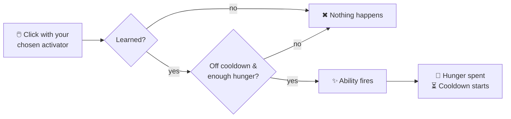

# Active HMs

Active HMs are fired on demand: pick one in the [HM wheel](../hm-wheel.md), then click with an
empty hand or the HM Case. Each use costs hunger and (most) start a cooldown.

There are **33 active HMs**.

---

## Acquisition table

Any one of the listed Pokémon can teach the HM. Hold the trigger item and **sneak + right-click** the Pokémon.

| HM | Pokémon (any of) | Trigger item |
|---|---|---|
| Water Gun | Squirtle, Totodile, Mudkip | Blue Dye |
| Leafage | Bulbasaur, Chikorita, Treecko, Snivy | Dandelion |
| Cut | Scyther, Scizor, Kartana | Stick |
| Rock Smash | Hitmonchan, Machop, Geodude | Flint |
| Rototiller | Drilbur, Excadrill | Coarse Dirt |
| Camouflage | Zorua, Kecleon, Ditto | Ink Sac |
| Strength | Machoke, Machamp, Conkeldurr | Iron Ingot |
| Waterfall | Gyarados, Ludicolo, Feraligatr | Prismarine Shard |
| Magnet Rise | Magnemite, Magneton, Magnezone | Iron Nugget |
| Ember | Charmander, Torchic, Tepig | Blaze Powder |
| Bullet Seed | Seedot, Nuzleaf, Cacnea | Wheat Seeds |
| Teleport | Abra, Kadabra, Alakazam, Ralts | Ender Eye |
| Fly | Pidgeot, Charizard, Dragonite | Phantom Membrane |
| Rain Dance | Politoed, Kyogre, Golduck | Prismarine Crystals |
| Sunny Day | Torkoal, Sunkern, Volcarona | Sunflower |
| Rest | Snorlax, Komala, Jigglypuff | Apple |
| Dig | Diglett, Dugtrio, Trapinch | Diamond Shovel |
| Explosion | Voltorb, Electrode | TNT |
| Thunder | Pikachu, Raichu, Zapdos | Lightning Rod |
| String Shot | Caterpie, Spinarak, Ariados | String |
| Defog | Togekiss, Mantine, Pelipper | Glass |
| Crabhammer | Kingler, Clawitzer | Mace |
| Revival Blessing | Rabsca | Totem of Undying |
| Charm | Jynx, Sylveon, Clefable | Pink Tulip |
| Stockpile | Gulpin, Swalot | Sponge |
| Substitute | Wobbuffet, Mew, Smeargle | Armor Stand |
| Lava Plume | Magcargo, Slugma, Turtonator | Magma Cream |
| Thief | Meowth, Purrloin, Sableye | Tripwire Hook |
| U-turn | Yanma, Ninjask, Venipede | Rabbit's Foot |
| Charge | Elekid, Electabuzz, Electivire | Redstone |
| Destiny Bond | Misdreavus, Duskull, Shuppet | Echo Shard |
| Sweet Scent | Gloom, Bellossom, Vileplume, Aromatisse | Lilac |
| Headbutt | Cranidos, Rampardos, Cubone | Iron Helmet |

---

## Ability details

### Water Gun
**Hunger:** 1 · **Cooldown:** 2s · **Power:** radius 3

Fires in the direction you're looking — extinguishes fire, wets sponges, and places a water block on the aimed surface.

---

### Leafage
**Hunger:** 1 · **Cooldown:** 2s · **Power:** radius 5

Instantly grows **every crop around you** to full maturity — handy for fast harvests.

---

### Cut
**Hunger:** 2 · **Cooldown:** none · **Power:** max 128 blocks

Treecapitator (BFS). Aim at a **log** → cut all connected logs (+ attached leaves); aim at a **leaf** → strip connected leaves. Drops match a Netherite Axe.

---

### Rock Smash
**Hunger:** 2 · **Cooldown:** none · **Power:** max 32 ores

Instantly breaks the block you aim at. If it's an **ore**, vein-mines all connected ore of that type; otherwise breaks the single pickaxe-minable block (Netherite Pickaxe drops).

---

### Rototiller
**Hunger:** 1 · **Cooldown:** none

Tills the dirt-type block you're aiming at into Farmland (Dirt, Grass Block, Coarse Dirt, Dirt Path).

---

### Camouflage
**Hunger:** 3 · **Cooldown:** 10s · **Power:** 6000t (**5 minutes**)

Become the **living creature** you're looking at. Your model is replaced by theirs — variant, gear
and all — for everyone who can see you.

- Aim at a **creature** in clear view → you look exactly like it for 5 minutes, or until you use
  Camouflage again.
- A block, a wall between you and it, or empty air → nothing happens. You can only copy something
  you can actually see.
- Other **players** can't be copied.

The disguise is a costume, not a creature: nothing extra exists in the world, so there is nothing
to hit, nothing in your way, and nothing that can be killed off you.

---

### Stockpile
**Hunger:** 1 · **Cooldown:** 1s · **Power:** lava self-damage 2

Drinks up the **water or lava** block you aim at (source or flowing) — handy for draining pools or
clearing a path. Water is free; **lava is spicy** and singes you for a little health each gulp.

---

### Strength
**Hunger:** 2 · **Cooldown:** none

Pushes the aimed block one block in whichever of the six directions you're looking — up and down
included. Containers travel with their contents, and a **double chest moves as one unit**: both
halves go together, or the push fails if either has nowhere to go. Won't move fluids.

---

### Substitute
**Hunger:** 4 · **Cooldown:** 20s · **Power:** 2400t (**2 minutes**)

Leaves a decoy of you standing where you were — wearing your head, your armour and whatever you
were holding. Hostile creatures already hunting you switch to the decoy while it stands, so it buys
you a way out of a fight. Casting it again replaces the decoy rather than adding a second.

---

### Waterfall
**Hunger:** 2 · **Cooldown:** 6s · **Power:** 40t

**While in water**, rides a strong upward current toward the surface. Must be in water to use.

---

### Lava Plume
**Hunger:** 2 · **Cooldown:** 6s · **Power:** 40t

Waterfall's twin for lava. **While in lava**, rides a rising current to the surface — and you are
immune to fire for the ride plus a few seconds after, so climbing out doesn't finish what the pool
started. Must be in lava to use.

---

### Magnet Rise
**Hunger:** 2 · **Cooldown:** 10s · **Power:** 100t (5s)

**Airborne-only** — you must be off the ground to use it. Grants **Levitation II + Slow Falling** for 5 seconds, letting you gain and hold height mid-air like a Magnezone. Using it on the ground does nothing.

---

### Ember
**Hunger:** 1 · **Cooldown:** 1s · **Power:** reach 5 blocks

Works like **Flint & Steel** — places fire, primes TNT, and ignites entities in front of you.

---

### Bullet Seed
**Hunger:** 2 · **Cooldown:** 1s · **Power:** 5 seeds per burst

Fires a rapid barrage of seed projectiles, consuming any `"seed"` items from your inventory. Direction is locked at activation.

---

### Teleport
**Hunger:** 5 · **Cooldown:** 5s · **Power:** max 30 blocks

Blinks you to the block you're looking at (≤ 30 blocks), finding the nearest safe landing. Plays the Enderman teleport sound.

---

### Fly
**Hunger:** 3 · **Cooldown:** 1s · **Power:** 1200t

Launches you skyward and engages **Glide** — ride the skies like a Charizard. Re-use it in the
air for a firework-style boost.

!!! note "Requires Glide"
    You must have **learned Glide** to use Fly. Using Fly automatically turns the Glide toggle on.
    It does **not** give or equip an Elytra item.

---

### Rain Dance
**Hunger:** 5 · **Cooldown:** 10s · **Power:** 6000t (5 min)

Summons **rain** on the overworld.

---

### Sunny Day
**Hunger:** 5 · **Cooldown:** 10s · **Power:** 6000t (5 min)

Clears the weather to **sunny**.

---

### Rest
**Hunger:** 0 required · **Cooldown:** 10 min

Restores your **full HP**, clears your status effects, and **skips the night** (like sleeping).
Leaves you hungry afterwards.

!!! warning "Multiplayer"
    In multiplayer, **all online players must agree** to rest within a short window.

---

### Dig
**Hunger:** 2 · **Cooldown:** none

Instantly breaks the shovel-minable block you're aiming at (Netherite Shovel drops).

---

### Explosion
**Hunger:** 15 · **Cooldown:** 10s · **Power:** 4 (blast radius)

A large explosion centered on you. **You survive at 1 HP**; everything around you does not.

---

### Thunder
**Hunger:** 3 · **Cooldown:** 5s · **Power:** 3 bolts

Calls down 3 lightning bolts around your position.

---

### String Shot
**Hunger:** 1 · **Cooldown:** 2s · **Power:** radius 1

Lays cobwebs around you, slowing anyone who walks into them.

---

### Defog
**Hunger:** 2 · **Cooldown:** 5s · **Power:** 10

Cures **your own negative status effects** (poison, wither, blindness, slowness, mining fatigue, weakness, hunger, unluck, levitation), leaving you fresh.

---

### Crabhammer
**Hunger:** 3 · **Cooldown:** 2s

A heavy mace swing: deals strong damage and knocks back all enemies within 3 blocks in front of you.

---

### Revival Blessing
**Hunger:** 1 · **Cooldown:** 20 min

Fully heals and **revives every Pokémon in your party** — clears faints and status. Drains **all** your hunger as the cost.

---

### Charm
**Hunger:** 2 · **Cooldown:** 3s · **Power:** 2400t (**2 minutes**)

Aim at a mob and use it — that mob becomes **charmed** and follows you around for 2 minutes (it paths toward you when more than ~3 blocks away). Great for relocating a stubborn animal or keeping an ally close.

---

### Thief
**Hunger:** 2 · **Cooldown:** 5s

Takes whatever the creature in your crosshair is holding in its main hand and puts it in your
inventory. Armour stays on. A creature with empty hands simply says so.

---

### U-turn
**Hunger:** 1 · **Cooldown:** 2s · **Power:** hop distance (tenths of a block)

Leaps you backwards and spins your view a full 180°, so you land already facing whatever you were
running from. A disengage — the leap without the turn just leaves you sprinting blind.

---

### Charge
**Hunger:** 2 · **Cooldown:** 3s · **Power:** 200t (**10 seconds**)

Turns the block you aim at into a redstone power source — enough to throw a door, a piston or a
lamp from across a room. **Temporary:** the original block comes back exactly as it was, and a
second cast puts the first one back before charging the next.

Blocks that hold something (chests, furnaces) are refused, because swapping them out and back would
lose what's inside.

---

### Destiny Bond
**Hunger:** 4 · **Cooldown:** 30s · **Power:** 200t (**10 seconds**)

For a short window, whatever kills you dies with you. Something you spend when you think you're
about to lose — not a permanent guarantee.

---

### Sweet Scent
**Hunger:** 6 · **Cooldown:** 30s · **Power:** 5 (how many turn up)

Draws a horde of wild Pokémon out of hiding all around you. Legendaries, mythicals, Ultra Beasts and
Paradox Pokémon never answer — a crowd you can summon on a cooldown would otherwise be a farm.

---

### Headbutt
**Hunger:** 2 · **Cooldown:** 2s · **Power:** drives the hop, the damage and the recoil

Hurls you forward head-first.

- Into a **tree**, the branches shake loose — sticks, saplings, the odd apple.
- Into a **creature**, it hurts them.
- Either way it hurts you. That's the joke.

Only the first impact of each charge counts, so wedging yourself against a trunk can't chew through
your health bar.
