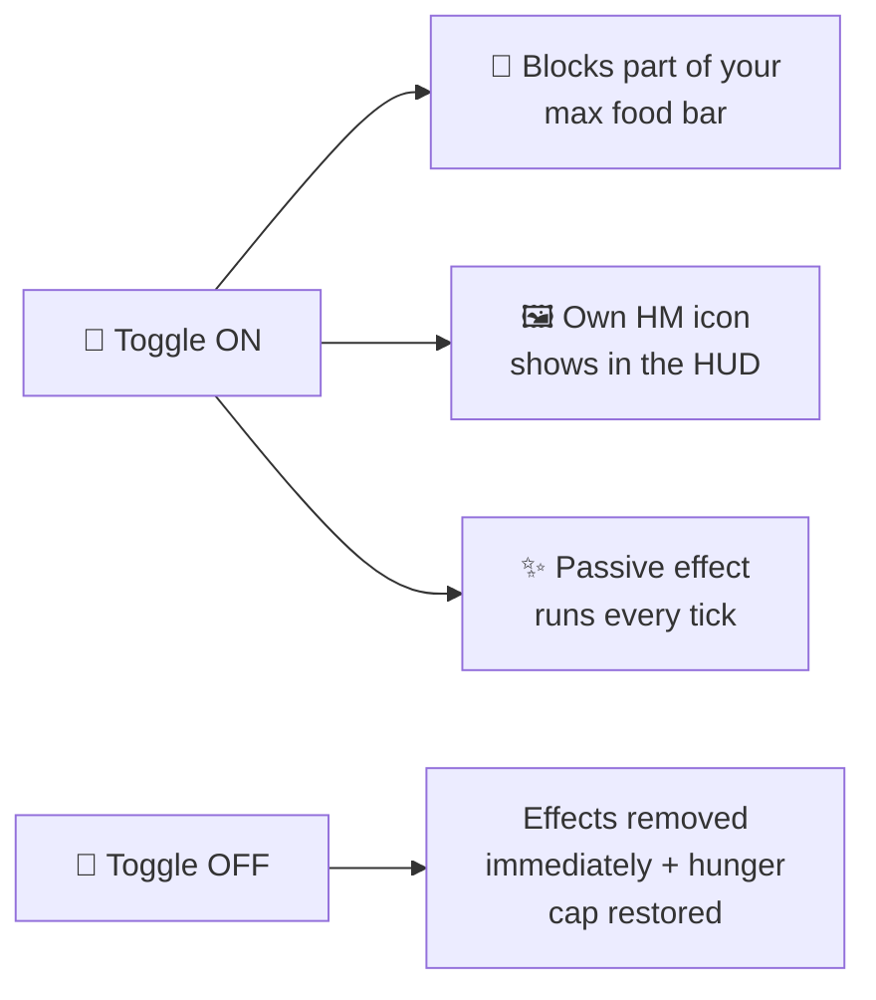
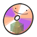
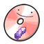
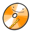
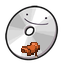

# Toggle HMs

Toggle HMs are **passive abilities** that stay active until you turn them off.
Switch them on from the inner ring of the [HM wheel](../hm-wheel.md), or with `/dittohm use <id>`.

!!! tip "HUD icons"
    Every enabled toggle shows its **own HM status-effect icon** in your HUD (top-right), so
    it's obvious at a glance which toggles are on. Wherever the game has an equivalent attribute,
    the toggle uses that instead of a status effect, so the HM entry is the only one in your
    inventory rather than a hidden duplicate sitting next to it.

---

## Hunger cost



Each enabled toggle **blocks food points** from your maximum food bar. Most block 2; **Harden**
blocks 3, **Burning Bulwark** 4, and **Magnet Rise** a full **15** — flight costs nearly the whole
budget, which is the point of it.
At your effective cap a slow **Regeneration I** effect keeps you healing normally.
The cap never drops below **2**.

| Food points blocked | Max hunger |
|---|---|
| 0 | 20 / 20 |
| 2 | 18 / 20 |
| 4 | 16 / 20 |
| 6 | 14 / 20 |
| 8 | 12 / 20 |
| … | … |
| 18+ | 2 / 20 (floor) |

When a toggle is turned **off**, its effects are removed **immediately**.

---

## Acquisition

| Disc | HM | Pokémon (any of) | Trigger item |
|---|---|---|---|
|  | Absorb | Gulpin, Swalot, Victreebel | Hopper |
|  | Acid Armor | Grimer, Muk, Goodra | Slime Block |
|  | Agility | Alakazam, Jolteon, Aerodactyl | Amethyst Shard |
|  | Bounce | Spoink, Aipom, Hoppip | Slimeball |
|  | Burning Bulwark | Gouging Fire | Blaze Rod |
|  | Dive | Vaporeon, Lapras, Wailord | Nautilus Shell |
|  | Flash | Ampharos, Jolteon, Lanturn | Glowstone Dust |
|  | Glide | Dragonite, Togekiss, Aerodactyl | Feather |
|  | Harden | Metapod, Kakuna, Silcoon, Cascoon | Shield |
|  | Helping Hand | Plusle, Minun, Audino | Saddle |
|  | Jump | Magikarp, Buneary, Spoink | Raw Cod |
|  | Lava Plume | Magcargo, Slugma, Turtonator | Magma Cream |
|  | Lucky Chant | Clefairy, Chimecho, Togetic | Emerald |
|  | Magnet Rise | Magnemite, Magneton, Magnezone | Iron Nugget |
|  | Mean Look | Mimikyu, Gengar, Noctowl | Ominous Bottle |
|  | Powder Snow | Cetoddle, Cetitan, Beartic | Powder Snow Bucket |
|  | Rock Climb | Rhydon, Rhyperior, Sneasel | Chain |
|  | Shadow Sneak | Gengar, Banette, Spiritomb | Black Dye |
|  | Snowscape | Froslass, Mamoswine | Blue Ice |
|  | Surf | Lapras, Kyogre, Suicune | Kelp |
|  | Swift | Ninjask, Accelgor, Electrode | Sugar |
|  | Tailwind | Talonflame, Noivern, Staraptor | Breeze Rod |
|  | U-turn | Yanma, Ninjask, Venipede | Rabbit's Foot |
|  | Vine Whip | Bulbasaur, Tangela | Vines |

---

## Ability details

###  Absorb
**HungerBlock:** 2 · **Power:** magnet radius 6

 — how it shows in your status bar while it runs.

Loose items on the ground drift toward you while it is on, so a scattered drop or a mined vein
gathers itself. Items are nudged rather than yanked, so they keep their normal pickup delay.

---

###  Acid Armor
**Blocks:** 3

 — how it shows in your status bar while it runs.

A caustic coat worth **a quarter of a full diamond set**, and whatever lands a blow on you gets
**poisoned** for its trouble.

One dose per hit, and only from whatever actually reached you — an archer three blocks back never
touched the acid.

---

###  Agility
**Blocks:** 2

 — how it shows in your status bar while it runs.

You move faster while it is on.

---

###  Bounce
**HungerBlock:** 2

 — how it shows in your status bar while it runs.

Every block you land on answers like a slime block. The harder you come down the higher you go, up
to a ceiling — and the bounce carries the impact away, so the landing doesn't hurt.

A short step doesn't bounce; you'd never get anywhere.

---

###  Burning Bulwark
**Blocks:** 4 · **Power:** thorns damage (default 2)

 — how it shows in your status bar while it runs.

Makes you **immune to fire** and **scorches hostile mobs that get too close** — any hostile within
~1.6 blocks is set alight and takes thorns damage twice a second. Pokémon and friendly mobs are
never harmed.

---

###  Dive
**Blocks:** 2

 — how it shows in your status bar while it runs.

Lets you **live and work underwater**. Water stops getting in your way:

- **Breathe underwater** — never run out of air.
- **Walk the seabed as if it were dry land** — no wading, no drag on every step.
- **Mine at full speed** — a block underwater breaks as fast as the same block in open air, and
  the weight a guardian temple puts on your arms lifts while you're under.

Dive takes penalties away; it never hands out a bonus. Push off the bottom and you swim at exactly
the speed you always did — if you want to be *fast* in the water, that's [Surf](#surf).

---

###  Flash
**Blocks:** 2

 — how it shows in your status bar while it runs.

Lets you **see clearly in the dark**, even in caves and at night. Toggle off to remove instantly.

---

###  Glide
**Blocks:** 2

 — how it shows in your status bar while it runs.

Lets you **glide like an Elytra without needing the item**. While airborne the real Elytra gliding
kicks in — dive to gain speed, level off to glide far. (Fly auto-enables this.)

---

###  Harden
**Blocks:** 3

 — how it shows in your status bar while it runs.

Hardens your body to **greatly reduce the damage you take** (+20 armour, +8 toughness applied via
attributes, plus damage resistance). Costs more hunger than other toggles.

---

###  Helping Hand
**Blocks:** 2 · **Power:** tenths of the stamina it spends (default 5 = half)

 — how it shows in your status bar while it runs.

Whatever you are riding keeps going **about twice as long** before it tires. Nothing else about the
mount changes — it is not faster, it does not recover any quicker, it simply has more in the tank.

```
/dittohm config helping_hand power <0-512>
```

---

###  Jump
**Blocks:** 2 · **Power:** Jump Boost level (default **IV**)

 — how it shows in your status bar while it runs.

Applies continuous **Jump Boost**. The `power` value equals the buff level, so `power = 4` gives Jump Boost IV. Shows in your HUD.

---

###  Lava Plume
**Blocks:** 2 · **Power:** tenths of the movement multiplier (default 17)

 — how it shows in your status bar while it runs.

Dive's twin for lava. It lets you **live and work down there**: move through lava and walk its floor
without the fluid dragging on every step, and breathe while you are under. Swimming out is exactly
as it always was — like Dive, it takes a penalty away rather than handing out a bonus.

**It gives you no fire protection of its own.** That is [Burning Bulwark](#burning-bulwark)'s job,
and two HMs handing out the same immunity would make one of them pointless — so Lava Plume asks for
it instead: you must have learned Burning Bulwark to switch Lava Plume on, and switching Lava Plume
on switches Burning Bulwark on with it. Between them they block 6 food from your maximum.

For the ride to the surface of a **water** pool, that is still **Waterfall**.

---

###  Lucky Chant
**Blocks:** 2

 — how it shows in your status bar while it runs.

Fortune leans your way while it lasts: what you break and what you fish give up a little more.

---

###  Magnet Rise
**Blocks:** 15

 — how it shows in your status bar while it runs.

**Flight.** Switch it on and you are off the ground for as long as you like, drifting at half your
walking pace with no dash.

The price is the steepest of any toggle and it is paid once: **fifteen** food points off your
maximum, out of a budget of eighteen. Flying is very nearly everything you have, which is the
point.

---

###  Mean Look
**Blocks:** 2 · **Power:** detect radius (default 30)

 — how it shows in your status bar while it runs.

Anything that means you harm **flees from you**, running away with real pathfinding — exactly like
creepers running from a cat (they even sprint when you get close).

That covers the mobs the game calls hostile, and **any Pokémon that is currently hunting you** —
wild Cobblemon are not hostile by species, they pick fights by behaviour, so the test is whether one
has decided to come for you. Everything else in the field is left exactly where it is, and other
players are never affected.

---

###  Powder Snow
**Blocks:** 3

 — how it shows in your status bar while it runs.

A cold you **carry**. Anything that comes near frosts over and starts to freeze, the way powder snow
freezes it, and thaws again once it is out of reach.

**Its edge is drawn on the ground**, at exactly the radius that bites — which matters more here than
anywhere else in the mod, because that edge is walking around with you. You are exempt from your own
cold, which is the only reason this can be worn at all.

---

###  Rock Climb
**Blocks:** 2

 — how it shows in your status bar while it runs.

Every vertical surface behaves like a ladder, and it is steered by the **movement keys**: **W**
climbs, **S** descends, and holding nothing holds your place on the wall.

Your horizontal movement is left alone, so you can travel along a face and step off it whenever you
like — a wall is something to climb, not something to be stuck to. On the ground it only takes over
when you are actually asking to go up, so walking and jumping near a wall work normally.

---

###  Shadow Sneak
**Blocks:** 3 · **Power:** percent of your speed you keep (default **55**)

 — how it shows in your status bar while it runs.

Total stealth on foot. No footstep sounds, no name over your head, and **nothing underfoot notices
you** — not pressure plates, not tripwires, not a sculk sensor.

You move slower than a walk for it, though faster than a crouch, so it is something you can actually
travel in rather than a stationary hiding trick.

!!! note "If you are already on a scoreboard team"
    The hidden nametag is done with a vanilla team, so a player who already belongs to one keeps
    their team and simply does not get that part of the effect. Everything else still applies.

---

###  Snowscape
**HungerBlock:** 2 · **Power:** trail radius 3

 — how it shows in your status bar while it runs.

Winter follows you on foot: snow settles around you as you walk, and **still water freezes over** as
you cross it. Flowing water is left alone, so a river keeps running instead of being paved.

---

###  Surf
**Blocks:** 2 · **Power:** tenths of the multiplier (default 15)

 — how it shows in your status bar while it runs.

Whatever you are **riding** cuts through water half again as fast. Your own swimming, on foot, is
untouched. Surf's twin in the air is **Tailwind**.

---

###  Swift
**Blocks:** 2 · **Power:** tenths of the multiplier (default 20)

 — how it shows in your status bar while it runs.

Whatever you are riding **gets up to speed twice as quickly** — off the mark, out of a turn, after
every stop. The only one of the three mount toggles that is not about top speed: **Surf** is faster
in water and **Tailwind** faster in the air, while Swift is quicker to get there in all three.

---

###  Tailwind
**Blocks:** 2 · **Power:** tenths of the multiplier (default 15)

 — how it shows in your status bar while it runs.

A following wind for whatever you are **flying** on: it moves half again as fast through the air.
Tailwind's twin in water is **Surf**.

---

###  U-turn
**Blocks:** 2

 — how it shows in your status bar while it runs.

Whatever you are riding **turns far more sharply** — on land, in water and in the air. Cornering is
not something that only happens on the ground, so it applies wherever your mount happens to be.

---

###  Vine Whip
**HungerBlock:** 2 · **Power:** 3 extra blocks of reach

 — how it shows in your status bar while it runs.

Reach further — blocks and creatures several paces away come within arm's length. Mining, placing
and hitting all get the extra range.
