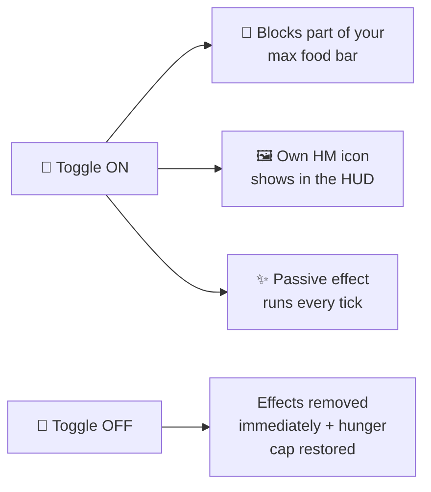

# Toggle HMs

Toggle HMs are **passive abilities** that stay active until you turn them off.
Switch them on from the inner ring of the [HM wheel](../hm-wheel.md), or with `/dittohm use <id>`.

There are **14 toggle HMs**.

!!! tip "HUD icons"
    Every enabled toggle shows its **own HM status-effect icon** in your HUD (top-right), so
    it's obvious at a glance which toggles are on. Wherever the game has an equivalent attribute,
    the toggle uses that instead of a status effect, so the HM entry is the only one in your
    inventory rather than a hidden duplicate sitting next to it.

---

## Hunger cost

Each enabled toggle **blocks food points** from your maximum food bar (most block 2; **Harden blocks 3**, **Burning Bulwark blocks 4**).
At your effective cap a slow **Regeneration I** effect keeps you healing normally.
The cap never drops below **2**.

| Food points blocked | Max hunger |
|---|---|
| 0 | 20 / 20 |
| 2 | 18 / 20 |
| 4 | 16 / 20 |
| 6 | 14 / 20 |
| 8 | 12 / 20 |
| … | … |
| 18+ | 2 / 20 (floor) |

When a toggle is turned **off**, its effects are removed **immediately**.

---

## Acquisition

| HM | Pokémon (any of) | Trigger item |
|---|---|---|
| Jump | Magikarp, Buneary, Spoink | Cod |
| Surf | Lapras, Kyogre, Suicune | Kelp |
| Rollout | Graveler, Golem, Spheal | Cobblestone |
| Dive | Vaporeon, Lapras, Wailord | Nautilus Shell |
| Flash | Ampharos, Jolteon, Lanturn | Glowstone Dust |
| Rock Climb | Rhydon, Rhyperior, Sneasel | Chain |
| Mean Look | Mimikyu, Gengar, Noctowl | Ominous Bottle |
| Harden | Metapod, Kakuna, Silcoon, Cascoon | Shield |
| Glide | Dragonite, Togekiss, Aerodactyl | Feather |
| Burning Bulwark | Gouging Fire | Blaze Rod |
| Absorb | Gulpin, Swalot, Victreebel | Hopper |
| Bounce | Spoink, Aipom, Hoppip | Slime Ball |
| Snowscape | Froslass, Mamoswine | Blue Ice |
| Vine Whip | Bulbasaur, Tangela | Vine |

---

## Ability details

### Jump
**Blocks:** 2 · **Power:** Jump Boost level (default **IV**)

Applies continuous **Jump Boost**. The `power` value equals the buff level, so `power = 4` gives Jump Boost IV. Shows in your HUD.

### Surf
**Blocks:** 2

Lets you **swim much faster** through water while the toggle is on.

### Rollout
**Blocks:** 2 · **Power:** speed amount

Increases your **movement speed** while active.

### Dive
**Blocks:** 2

- **Breathe underwater** — never run out of air.
- You gently **sink** when you stop swimming, so you can stay down and explore. The sink only
  kicks in while you're idle and drifting down — swimming in any direction (including up) stops
  it, so it never fights your swimming.

### Flash
**Blocks:** 2

Lets you **see clearly in the dark**, even in caves and at night. Toggle off to remove instantly.

### Rock Climb
**Blocks:** 2

Lets you **climb any wall you're facing** — while airborne, look at a wall to climb up; hold
**sneak** to climb down. No vanilla movement buffs are applied.

### Mean Look
**Blocks:** 2 · **Power:** detect radius (default 30)

Nearby **hostile mobs flee from you**, running away with real pathfinding — exactly like creepers
running from a cat (they even sprint when you get close). It **never** affects Pokémon, friendly
mobs, or other players.

### Harden
**Blocks:** 3

Hardens your body to **greatly reduce the damage you take** (+20 armour, +8 toughness applied via
attributes, plus damage resistance). Costs more hunger than other toggles.

### Glide
**Blocks:** 2

Lets you **glide like an Elytra without needing the item**. While airborne the real Elytra gliding
kicks in — dive to gain speed, level off to glide far. (Fly auto-enables this.)

### Burning Bulwark
**Blocks:** 4 · **Power:** thorns damage (default 2)

Makes you **immune to fire** and **scorches hostile mobs that get too close** — any hostile within
~1.6 blocks is set alight and takes thorns damage twice a second. Pokémon and friendly mobs are
never harmed.

---

### Absorb
**HungerBlock:** 2 · **Power:** magnet radius 6

Loose items on the ground drift toward you while it is on, so a scattered drop or a mined vein
gathers itself. Items are nudged rather than yanked, so they keep their normal pickup delay.

---

### Bounce
**HungerBlock:** 2

Every block you land on answers like a slime block. The harder you come down the higher you go, up
to a ceiling — and the bounce carries the impact away, so the landing doesn't hurt.

A short step doesn't bounce; you'd never get anywhere.

---

### Snowscape
**HungerBlock:** 2 · **Power:** trail radius 3

Winter follows you on foot: snow settles around you as you walk, and **still water freezes over** as
you cross it. Flowing water is left alone, so a river keeps running instead of being paved.

---

### Vine Whip
**HungerBlock:** 2 · **Power:** 3 extra blocks of reach

Reach further — blocks and creatures several paces away come within arm's length. Mining, placing
and hitting all get the extra range.
