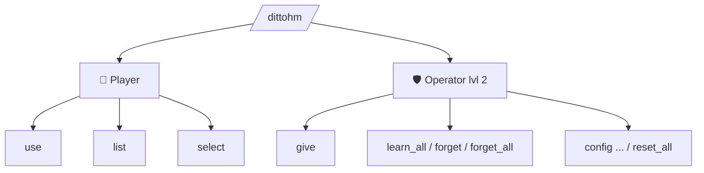

# Commands

The command root is `/dittohm`.



## Player commands

```
/dittohm use <ability>
```
Activates an ability you have learned (or toggles a passive on/off).

```
/dittohm list
```
Shows all 35 abilities with your learn status, toggle state, and configured hunger/cooldown.

```
/dittohm select <ability>
```
Sets the active ability in the HM Case currently in your hotbar.

---

## Operator commands

Require **permission level 2**:

```
/dittohm give <ability> <player>
```
Gives the HM Disc for the specified ability.

```
/dittohm learn_all [player]
```
Instantly learns **all 35 HMs** for a player (does **not** auto-enable toggles).

```
/dittohm forget <ability> [player]
/dittohm forget_all [player]
```
Unlearns one or all HMs.

```
/dittohm config <ability> hunger <0–20>
/dittohm config <ability> cooldown <0–24000>
/dittohm config <ability> power <0–512>
/dittohm config <ability> hungerblock <0–20>   (toggles only)
/dittohm config <ability> reset
/dittohm config reset_all
```

!!! tip "After updating the mod"
    If ability ordinals changed between versions, run `/dittohm config reset_all` and
    re-learn (`/dittohm forget_all` then `/dittohm learn_all`) to clear stale save data.

---

## Ability IDs

### Active (24)

| ID | Display name |
|---|---|
| `water_gun` | Water Gun |
| `leafage` | Leafage |
| `cut` | Cut |
| `rock_smash` | Rock Smash |
| `rototiller` | Rototiller |
| `camouflage` | Camouflage |
| `strength` | Strength |
| `waterfall` | Waterfall |
| `magnet_rise` | Magnet Rise |
| `ember` | Ember |
| `bullet_seed` | Bullet Seed |
| `teleport` | Teleport |
| `fly` | Fly |
| `rain_dance` | Rain Dance |
| `sunny_day` | Sunny Day |
| `rest` | Rest |
| `dig` | Dig |
| `explosion` | Explosion |
| `thunder` | Thunder |
| `string_shot` | String Shot |
| `defog` | Defog |
| `crab_hammer` | Crabhammer |
| `revival_blessing` | Revival Blessing |
| `charm` | Charm |

### Toggle (10)

| ID | Display name |
|---|---|
| `jump` | Jump |
| `surf` | Surf |
| `rollout` | Rollout |
| `dive` | Dive |
| `flash` | Flash |
| `rock_climb` | Rock Climb |
| `mean_look` | Mean Look |
| `harden` | Harden |
| `glide` | Glide |
| `burning_bulwark` | Burning Bulwark |
