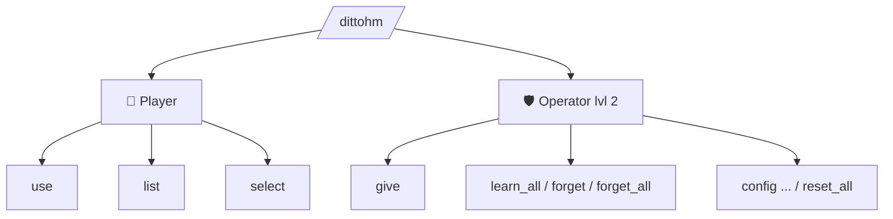

# Commands

The command root is `/dittohm`.



## Player commands

```
/dittohm use <ability>
```
Activates an ability you have learned (or toggles a passive on/off).

```
/dittohm list
```
Shows every ability with your learn status, toggle state, and configured hunger/cooldown.

```
/dittohm select <ability>
/dittohm select none
```
Selects an active HM without opening the [HM wheel](hm-wheel.md), or clears the selection.

---

## Operator commands

Require **permission level 2**:

!!! note "Every command takes an optional player"
    `give`, `learn`, `select`, `forget`, `forget_all` and both `trader` actions accept a trailing
    `[player]`. Leave it off and the command applies to you.

```
/dittohm give <ability> [player]
```
Gives the HM Disc for the specified ability — the operator's way in, since nothing in
survival hands one out any more. Right-clicking it still teaches the HM.

```
/dittohm learn <ability> [player]
```
Teaches the ability outright, with no disc involved.

```
/dittohm trader spawn [player]
/dittohm trader forget [player]
```
Summons a Trainer Ditto on demand, or undoes a catch so it will visit that player again.

```
/dittohm learn_all [player]
```
Instantly learns **every HM** for a player (does **not** auto-enable toggles).

```
/dittohm forget <ability> [player]
/dittohm forget_all [player]
```
Unlearns one or all HMs.

```
/dittohm config <ability> hunger <0–20>
/dittohm config <ability> cooldown <0–24000>
/dittohm config <ability> power <0–512>
/dittohm config <ability> hungerblock <0–20>   (toggles only)
/dittohm config <ability> reset
/dittohm config reset_all
```

!!! tip "After updating the mod"
    If ability ordinals changed between versions, run `/dittohm config reset_all` and
    re-learn (`/dittohm forget_all` then `/dittohm learn_all`) to clear stale save data.

---

## Ability IDs

### Active

| ID | Display name |
|---|---|
| `water_gun` | Water Gun |
| `leafage` | Leafage |
| `cut` | Cut |
| `rock_smash` | Rock Smash |
| `rototiller` | Rototiller |
| `camouflage` | Camouflage |
| `strength` | Strength |
| `waterfall` | Waterfall |
| `ember` | Ember |
| `bullet_seed` | Bullet Seed |
| `teleport` | Teleport |
| `fly` | Fly |
| `rain_dance` | Rain Dance |
| `sunny_day` | Sunny Day |
| `rest` | Rest |
| `dig` | Dig |
| `explosion` | Explosion |
| `thunder` | Thunder |
| `string_shot` | String Shot |
| `defog` | Defog |
| `crab_hammer` | Crabhammer |
| `revival_blessing` | Revival Blessing |
| `charm` | Charm |
| `stockpile` | Stockpile |
| `substitute` | Substitute |
| `thief` | Thief |
| `charge` | Charge |
| `destiny_bond` | Destiny Bond |
| `sweet_scent` | Sweet Scent |
| `headbutt` | Headbutt |
| `egg_bomb` | Egg Bomb |
| `eruption` | Eruption |
| `miracle_eye` | Miracle Eye |
| `protect` | Protect |
| `celebrate` | Celebrate |
| `tail_whip` | Tail Whip |
| `whirlwind` | Whirlwind |
| `barrier` | Barrier |
| `x_scissor` | X-Scissor |
| `earthquake` | Earthquake |
| `rock_throw` | Rock Throw |
| `present` | Present |
| `blizzard` | Blizzard |
| `boomerang` | Boomerang |
| `decorate` | Decorate |

### Toggle

| ID | Display name |
|---|---|
| `magnet_rise` | Magnet Rise |
| `jump` | Jump |
| `surf` | Surf |
| `agility` | Agility |
| `dive` | Dive |
| `flash` | Flash |
| `rock_climb` | Rock Climb |
| `mean_look` | Mean Look |
| `harden` | Harden |
| `glide` | Glide |
| `burning_bulwark` | Burning Bulwark |
| `lava_plume` | Lava Plume |
| `u_turn` | U-turn |
| `bounce` | Bounce |
| `snowscape` | Snowscape |
| `vine_whip` | Vine Whip |
| `absorb` | Absorb |
| `helping_hand` | Helping Hand |
| `tailwind` | Tailwind |
| `swift` | Swift |
| `lucky_chant` | Lucky Chant |
| `acid_armor` | Acid Armor |
| `powder_snow` | Powder Snow |
| `shadow_sneak` | Shadow Sneak |
| `obstruct` | Obstruct |
| `confusion` | Confusion |
