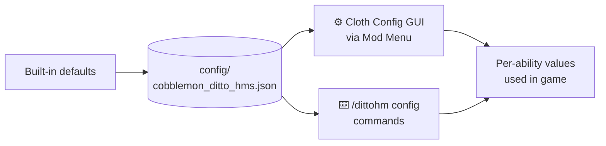

# Configuration



Every ability has these tunable values:

| Parameter | Description |
|---|---|
| **Hunger** | Food levels required and consumed per use (0 = free) |
| **Cooldown** | Ticks between uses (20 ticks = 1 second; 0 = no cooldown) |
| **Power** | Ability-specific: radius, duration, damage, count, level, etc. |
| **HungerBlock** | *(toggles only)* food points blocked from your max while enabled |

---

## Cloth Config GUI (Fabric)

Open **Mod Menu → Cobblemon Ditto HMs → ⚙** to see sliders for every ability's three values.  
Changes save automatically.

---

## In-game commands

Operator-only (`permission level 2`):

```
/dittohm config <ability> hunger <0–20>
/dittohm config <ability> cooldown <0–24000>
/dittohm config <ability> power <0–512>
/dittohm config <ability> hungerblock <0–20>   (toggles only)
/dittohm config <ability> reset
/dittohm config reset_all
```

---

## Config file

The file is saved at:

- **Fabric:** `config/cobblemon_ditto_hms.json`
- **NeoForge:** `config/cobblemon_ditto_hms.json`

You can edit it directly — changes take effect on next server start.

---

## Default values — Active HMs

| Ability | Hunger | Cooldown | Power |
|---|---|---|---|
| Water Gun | 1 | 2s | radius 3 |
| Leafage | 1 | 2s | radius 5 |
| Cut | 2 | none | max 128 blocks |
| Rock Smash | 2 | none | max 32 ores |
| Rototiller | 1 | none | 1 block |
| Camouflage | 3 | 10s | 5 min duration |
| Strength | 2 | none | 1 block push |
| Waterfall | 2 | 6s | levitation burst |
| Magnet Rise | 2 | 10s | 5s effect (airborne only) |
| Ember | 1 | 1s | reach 5 blocks |
| Bullet Seed | 2 | 1s | 5 seeds/burst |
| Teleport | 5 | 5s | max 30 blocks |
| Fly | 3 | 1s | launch + Glide (needs Glide) |
| Rain Dance | 5 | 10s | 5 min rain |
| Sunny Day | 5 | 10s | 5 min clear |
| Rest | 0* | 10 min | — |
| Dig | 2 | none | Haste III |
| Explosion | 15 | 10s | blast 4 |
| Thunder | 3 | 5s | 3 bolts |
| String Shot | 1 | 2s | radius 1 |
| Defog | 2 | 5s | radius 10 |
| Crabhammer | 3 | 2s | — |
| Revival Blessing | 1 | 20 min | — |
| Charm | 2 | 3s | 2 min follow |

\* Rest does not require hunger.

## Default values — Toggle HMs

| Ability | HungerBlock | Power |
|---|---|---|
| Jump | 2 | Jump Boost level (4 = IV) |
| Surf | 2 | Dolphin's Grace |
| Rollout | 2 | Speed amplifier (0 = I) |
| Dive | 2 | Water Breathing |
| Flash | 2 | Night Vision |
| Rock Climb | 2 | climb any wall |
| Mean Look | 2 | detect radius 30 (hostiles flee) |
| Harden | 3 | full diamond armour |
| Glide | 2 | elytra-like glide |
| Burning Bulwark | 4 | thorns damage (2) |
