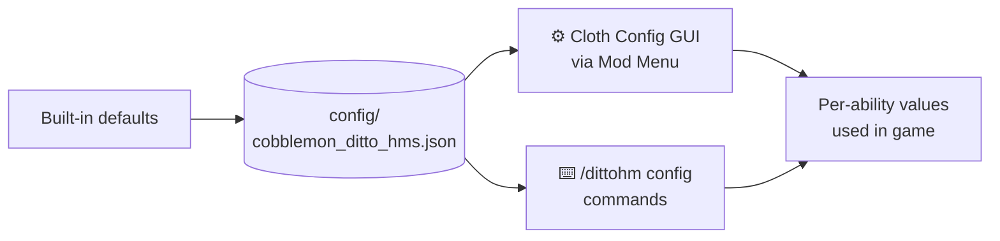

# Configuration



## Activation

How an HM fires is two settings, because no single answer suits everyone:

| Setting | Options | Notes |
|---|---|---|
| **Activator item** | Empty hand · HM Case · either *(default)* | The empty hand costs you punching and hand-mining while an HM is selected; the Case costs a hotbar slot |
| **Activator button** | **Left-click** *(default)* · Right-click · either | Left never opens chests or doors; right is answered by interactable blocks first |

There is also **HM wheel disc size** (50%–400%) in the same section, for when the discs read too
big or too small at your GUI scale.

Both activator settings live at the top of the config screen, and as commands:

```
/dittohm config activator item empty_hand|hm_case|either
/dittohm config activator button left|right|either
```

---

## Trainer Ditto

| Setting | Default | What it does |
|---|---|---|
| **Visits** | on | Whether the trader appears at all |
| **Appears every** | 36000 ticks (30 min) | How long the whole server waits between appearances |
| **Stays for** | 6000 ticks (5 min) | How long it waits before wandering off |
| **Guaranteed perfect IVs** | 0 | Rolled like any wild Ditto · 1 gives it one best stat · 6 is flawless |
| **Level** | 15–45 | The band its level is rolled from, inclusive |

```
/dittohm config trader enabled <true|false>
/dittohm config trader every <1200-1728000>
/dittohm config trader stay <200-72000>
/dittohm config trader ivs <0-6>
/dittohm config trader levels <min> <max>
```

One appearance is **one trader for the whole server**, not one per player, and everybody is told in
chat when it arrives and when it leaves. The clock runs while the server is empty and survives a
restart; an appearance that lands with nobody eligible is missed rather than saved up.

It always offers **five** discs, rolled once and kept for as long as that trader is standing there.
Which five is weighted per HM — see [Trader weight](#trader-weight) below.

It stops visiting a player for good once they catch it, and it keeps its distance from anyone who
has caught one **or beaten one in battle**, so bring a friend who has done neither.

---

## Per-ability values

Every ability has these tunable values:

| Parameter | Description |
|---|---|
| **Hunger** | Food levels required and consumed per use (0 = free) |
| **Cooldown** | Ticks between uses (20 ticks = 1 second; 0 = no cooldown) |
| **Power** | Ability-specific: radius, duration, damage, count, level, etc. |
| **HungerBlock** | *(toggles only)* food points blocked from your max while enabled |
| **Trader weight** | How often the Trainer Ditto offers this disc, against the others |
| **Required level** | Experience level needed before the HM will fire (every HM ships at 0) |

### Required level

A **requirement, not a price**: nothing is deducted when the HM fires, you simply cannot reach for
it until you have got there. Every HM ships at **0**, so nothing is gated unless a pack says so.

An HM you have not qualified for is greyed out in the wheel and says which level it wants, and it
comes back to life the moment you level up. Switching a toggle **off** is never gated, so raising a
requirement can never strand someone inside an effect they cannot end.

### Trader weight

A weight, not a percentage: what an HM's share works out to depends on which ones you still have
left to learn. **10** is the common default, **6** covers the ones that reshape how you mine or
fight, and **3** is reserved for flight, blinking, a free heal and a suit of armour. **0** keeps an
HM out of the stall entirely — unless everything you have left is at 0, in which case the roll
falls back to even odds rather than leaving the stall empty.

---

## Cloth Config GUI (Fabric)

Open **Mod Menu → Cobblemon Ditto HMs → ⚙** to see sliders for every ability's values.  
Changes save automatically.

---

## In-game commands

Operator-only (`permission level 2`):

```
/dittohm config <ability> hunger <0–20>
/dittohm config <ability> cooldown <0–24000>
/dittohm config <ability> power <0–512>
/dittohm config <ability> hungerblock <0–20>   (toggles only)
/dittohm config <ability> weight <0–100>
/dittohm config <ability> minlevel <0–100>
/dittohm config <ability> reset
/dittohm config reset_all
/dittohm config activator item <empty_hand|hm_case|either>
/dittohm config activator button <left|right|either>
```

---

## Config file

The file is saved at:

- **Fabric:** `config/cobblemon_ditto_hms.json`
- **NeoForge:** `config/cobblemon_ditto_hms.json`

You can edit it directly — changes take effect on next server start.

---

## Default values — Active HMs

Durations in the **Power** column are in **ticks** (20 ticks = 1 second), because that is
what the config takes.

Durations in the **Power** column are in **ticks** (20 ticks = 1 second), because that is
what the config takes.

| Ability | Hunger | Cooldown | Power |
|---|---|---|---|
| Water Gun | 1 | 2s | 3 |
| Leafage | 1 | 2s | 5 |
| Cut | 2 | none | 128 |
| Rock Smash | 2 | none | 32 |
| Rototiller | 1 | none | 1 |
| Camouflage | 3 | 15 min | duration — **18000** |
| Strength | 2 | none | 1 |
| Waterfall | 2 | 6s | 40 |
| Ember | 1 | 1s | 5 |
| Bullet Seed | 2 | 1s | 5 |
| Teleport | 5 | 5s | 30 |
| Fly | 3 | 1s | 1200 |
| Rain Dance | 5 | 10s | 6000 |
| Sunny Day | 5 | 10s | 6000 |
| Rest | 0 | 10 min | — |
| Dig | 2 | none | 1 |
| Explosion | 15 | 10s | 4 |
| Thunder | 3 | 5s | 3 |
| String Shot | 1 | 2s | 1 |
| Defog | 2 | 5s | 10 |
| Crabhammer | 3 | 2s | 1 |
| Revival Blessing | 1 | 20 min | — |
| Charm | 2 | 3s | follow duration in ticks — **2400** |
| Stockpile | 1 | 1s | lava self-damage — **7** |
| Substitute | 4 | 20s | decoy lifetime in ticks — **2400** |
| Thief | 2 | 5s | 1 |
| Charge | 2 | 3s | ticks between sparks — **10** |
| Destiny Bond | 4 | 30s | how long the bond holds — **200** |
| Sweet Scent | 6 | 90s | how many turn up — **5** |
| Headbutt | 2 | 2s | 14 |
| Egg Bomb | 2 | 3s | tenths of blast strength — **10** |
| Eruption | 5 | 10s | how many blocks away it can be aimed — **5** |
| Miracle Eye | 5 | 30s | search radius in CHUNKS, as /locate counts — **100** |
| Protect | 1 | 10s | ticks of immunity — **20** |
| Celebrate | 1 | 10 min | how many rockets — **8** |
| Tail Whip | 2 | 2s | 1 |
| Whirlwind | 2 | 5s | percent of the full gust — **100** |
| Barrier | 3 | 15s | how long the wall stands — **600** |
| X-Scissor | 2 | 3s | radius — **5** |
| Earthquake | 4 | 10s | radius — **5** |
| Rock Throw | 1 | 1s | tenths of a half-heart — **40** |
| Present | 12 | 20 min | — |
| Blizzard | 6 | 30s | radius — **180** |
| Boomerang | 1 | 1.5s | tenths of a half-heart — **50** |
| Decorate | 4 | 1 min | percent chance of a shiny — **5** |

\* Rest does not require hunger.
| Confusion | 3 | 10s | how long it lasts — **200** |
| Obstruct | 3 | 1 min | how long the seal holds — **6000** |

## Default values — Toggle HMs

| Ability | HungerBlock | Power |
|---|---|---|
| Magnet Rise | 15 | 25 |
| Jump | 2 | Jump Boost level — **4** |
| Surf | 2 | tenths of the mount's swim-speed multiplier — **15** |
| Agility | 2 | — |
| Dive | 2 | — |
| Flash | 2 | — |
| Rock Climb | 2 | — |
| Mean Look | 2 | repel radius — **30** |
| Harden | 3 | — |
| Glide | 2 | — |
| Burning Bulwark | 4 | thorns damage — **2** |
| Lava Plume | 2 | tenths of the lava-stride multiplier — **17** |
| U-turn | 2 | tenths of the mount's turn multiplier — **18** |
| Bounce | 2 | — |
| Snowscape | 2 | trail radius — **3** |
| Vine Whip | 2 | extra blocks of reach — **3** |
| Absorb | 2 | magnet radius — **6** |
| Helping Hand | 2 | tenths of the stamina SPEND — **2** |
| Tailwind | 2 | tenths of the mount's flight-speed multiplier — **15** |
| Swift | 2 | tenths of the mount's acceleration multiplier — **20** |
| Lucky Chant | 2 | Luck amplifier — **1** |
| Acid Armor | 3 | poison ticks — **900** |
| Powder Snow | 3 | radius of the cold — **5** |
| Shadow Sneak | 3 | percent of your speed you keep — **55** |
