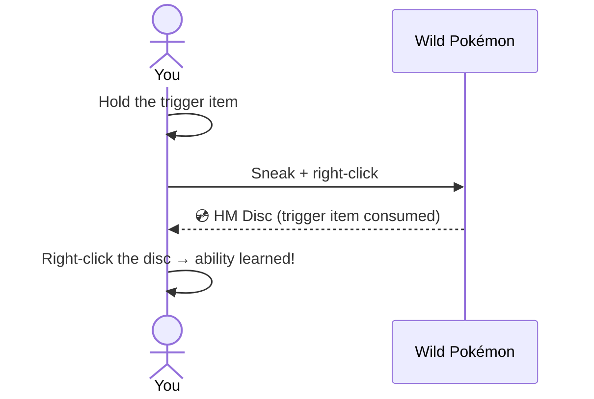
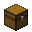

# Getting Started

## Obtaining HM Discs

Each ability is locked behind a **Pokémon interaction**. To unlock one:

1. Locate the required Pokémon in the world (or spawn it with `/pokespawn <species>`).
2. Hold the **trigger item** in your main hand.
3. **Sneak + right-click** the Pokémon.
4. The trigger item is consumed and the Pokémon gives you the **HM Disc**.

!!! tip
    Operators can get HM Discs directly with `/dittohm give <ability_id> <player>` without interacting with a Pokémon.

---

## Learning an ability

Once you have an HM Disc:

- **Right-click** the disc → the ability is **permanently learned** and the disc stays in your inventory as a reusable badge.
- **Left-click** with a learned disc to **use** the ability (or toggle a passive on/off).
- Learned abilities persist across deaths and world reloads (stored server-side).

---

## Crafting the HM Case

The **HM Case** lets you manage all learned abilities from a single hotbar slot.

**Recipe (shapeless)** — drop the ingredients anywhere in the crafting grid:

  

    

    

    

    

    

    

    

    

    

  

  
➜

  

| Ingredient | Quantity |
|---|---|
|  Chest | 1 |
|  Diamond | 1 |
|  Red Apricorn | 1 |
|  Yellow Apricorn | 1 |
|  Green Apricorn | 1 |
|  Blue Apricorn | 1 |
|  Black Apricorn | 1 |
|  White Apricorn | 1 |
|  Pink Apricorn | 1 |
| **→  HM Case** | **1** |

---

## Using the HM Case

| Action | Result |
|---|---|
| **Left-click** | Uses the currently selected (active) HM |
| **Right-click** | Opens the HM Case GUI |

In the GUI you can:

- See all 35 HMs (grey glass = not yet learned, disc icon = learned)
- **Right-click** an **Active HM** to set it as the quick-use ability
- **Right-click** a **Toggle HM** to enable or disable it
- **Left-click + drag** an HM onto another slot in the same section to reorder them

See the [HM Case guide](hm-case.md) for full details.

---

## The hunger system

- **Active HMs** cost hunger on use (configurable per ability).
- **Toggle HMs** block your maximum hunger while enabled — most reduce your max food bar by **2 points** (Harden by **3**, Burning Bulwark by **4**). You still regenerate health at the cap via a slow Regeneration effect. The cap never drops below 2.

| Food points blocked | Max hunger |
|---|---|
| 0 | 20 / 20 |
| 2 | 18 / 20 |
| 4 | 16 / 20 |
| 6 | 14 / 20 |
| 8 | 12 / 20 |
