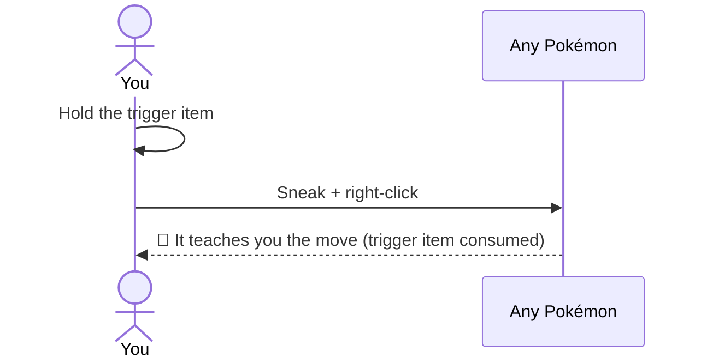

# Getting Started

## Learning an HM

Every ability is locked behind a **Pokémon interaction**. To learn one:

1. Find one of the Pokémon that teaches it. **It does not have to be wild** — your own sent-out
   Pokémon works, and so does another player's. Nothing checks who owns it. (Or spawn one with
   `/pokespawn <species>`.)
2. Hold the **trigger item** in your main hand.
3. **Sneak + right-click** the Pokémon.
4. The trigger item is consumed and the Pokémon **teaches you the move**, permanently.

The HM now lives in your **HM wheel** — there is nothing to craft and nothing to carry — and it
stays there across deaths and world reloads.

!!! info "What you know cannot be handed over"
    Nothing changes hands. An item can go in a chest and be posted to somebody who never went
    looking for the Pokémon that knows the move, and an HM that can be posted is not something
    anybody had to earn. **HM Discs still exist**, but only as an operator's tool — the creative
    tab and `/dittohm give <ability_id> <player>`. Nothing in survival hands one out.

!!! tip "A shortcut you may stumble into"
    A rare wandering **Trainer Ditto** turns up now and then with five HMs laid out, each costing
    only that HM's own trigger item — it skips the hunt for the right Pokémon entirely. If you have
    not learned a single HM yet, the first one it teaches you is **free**.

    It is a Ditto in a coat. Throw a Poké Ball and you catch it like any other — but every trader
    after that keeps its distance and **will not open its stall for you again**, so weigh the shop
    against the Ditto. How good that Ditto is is the server's call, and **out of the box it rolls
    its IVs like any other**: guaranteed perfect stats are an option an operator turns on, not
    something the trader comes with.

---

## Using an ability

Press **H** to open the [HM wheel](hm-wheel.md). Active HMs sit on the outer ring and toggles on
the inner one — **only the ones you have actually learned** — each tinted by the type of the move it
is named after, and toggles marked with a small light that is green while they are running.

| Ring | What a pick does |
|---|---|
| **Outer — active HMs** | Selects it |
| **Inner — toggle HMs** | Switches it on or off straight away |
| **Centre** | The bullseye cancels; the ring of brushes around it clears everything |

An active HM then fires on a click — by default either button, with an **empty hand** or while
holding the **HM Case**. Anything else in your hand keeps its normal click, so tools, weapons and
blocks behave exactly as they always did. Both halves are configurable; see
[HM Wheel](hm-wheel.md).

!!! tip "Getting your fist back"
    While an HM is selected, a bare-handed click fires it instead of punching or hand-mining. Pick
    the **centre** of the wheel to clear the selection — or set the activator to **HM Case** so
    your fist is never involved.

---

## The hunger system

- **Active HMs** cost hunger on use (configurable per ability) — or **experience**, if the server
  says so. Every HM carries one price, quoted in food, and the server picks the currency:
  experience then hunger (the default), hunger then experience, or strictly one of the two.
  Installing [Cobblemon: PlayerXP](https://modrinth.com/mod/cobblemon-playerxp) is what makes
  the experience modes worth using — it pays you for the battles your Pokémon win, so the
  currency refills from the thing you were already doing.
- **Toggle HMs** block your maximum hunger while enabled — most reduce your max food bar by **2
  points**, a few by more, and **Magnet Rise by 15**, because flight should cost nearly everything
  you have. You still regenerate health at the cap. The cap never drops below 2.
- Food you cannot use is **refused** rather than wasted: at the cap, eating is simply declined.
- The wheel draws all of this as a bar down its side — what the running toggles have taken, what you
  have left, and what the HM under your cursor would cost.

| Food points blocked | Max hunger |
|---|---|
| 0 | 20 / 20 |
| 2 | 18 / 20 |
| 4 | 16 / 20 |
| 6 | 14 / 20 |
| 8 | 12 / 20 |
