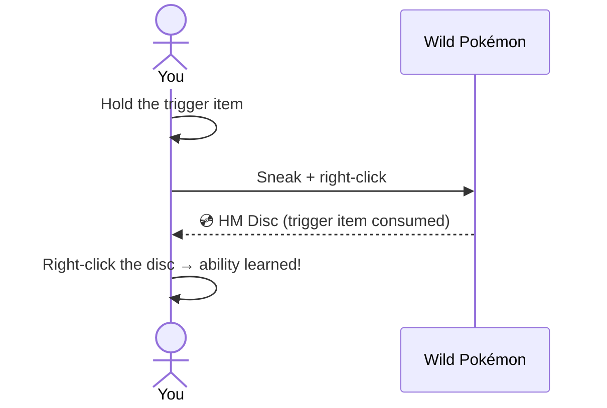

# Getting Started

## Obtaining HM Discs

Each ability is locked behind a **Pokémon interaction**. To unlock one:

1. Locate the required Pokémon in the world (or spawn it with `/pokespawn <species>`).
2. Hold the **trigger item** in your main hand.
3. **Sneak + right-click** the Pokémon.
4. The trigger item is consumed and the Pokémon gives you the **HM Disc**.

!!! tip
    Operators can get HM Discs directly with `/dittohm give <ability_id> <player>` without interacting with a Pokémon.

---

## Learning an ability

Once you have an HM Disc:

- **Right-click** the disc → the ability is **permanently learned**. That is all the disc does; in
  survival it is consumed doing it.
- The ability now lives in your **HM wheel** — there is nothing to craft and nothing to carry.
- Learned abilities persist across deaths and world reloads (stored server-side).

!!! tip "A shortcut you may stumble into"
    A rare wandering **Trainer Ditto** turns up now and then with five HM Discs laid out, each
    costing only that HM's own trigger item — it skips the hunt for the right Pokémon entirely.
    If you haven't learned a single HM yet, your first disc from it is **free**.

    It is a Ditto in a coat. Throw a Poké Ball and you catch it like any other — but then it never
    comes looking for you again — it will actually run from you on sight — so weigh the disc
    stall against the perfect-IV Ditto.

---

## Using an ability

Press **H** to open the [HM wheel](hm-wheel.md). The 25 active HMs sit on the outer ring, the 10
toggles on the inner one, each tinted by the type of the move it is named after.

| Ring | What a pick does |
|---|---|
| **Outer — active HMs** | Selects it |
| **Inner — toggle HMs** | Switches it on or off straight away |
| **Centre** | Clears your selection |

An active HM then fires on a click — by default either button, with an **empty hand** or while
holding the **HM Case**. Anything else in your hand keeps its normal click, so tools, weapons and
blocks behave exactly as they always did. Both halves are configurable; see
[HM Wheel](hm-wheel.md).

!!! tip "Getting your fist back"
    While an HM is selected, a bare-handed click fires it instead of punching or hand-mining. Pick
    the **centre** of the wheel to clear the selection — or set the activator to **HM Case** so
    your fist is never involved.

---

## The hunger system

- **Active HMs** cost hunger on use (configurable per ability).
- **Toggle HMs** block your maximum hunger while enabled — most reduce your max food bar by **2 points** (Harden by **3**, Burning Bulwark by **4**). You still regenerate health at the cap via a slow Regeneration effect. The cap never drops below 2.

| Food points blocked | Max hunger |
|---|---|
| 0 | 20 / 20 |
| 2 | 18 / 20 |
| 4 | 16 / 20 |
| 6 | 14 / 20 |
| 8 | 12 / 20 |
