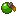
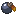
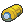

# HM Case

The **HM Case** is a crafteable item that consolidates all 35 learned HMs into a single hotbar slot.
It replaces the need to hold individual HM Discs and provides a management GUI.

---

## Crafting

Shapeless recipe (9 ingredients) — 1× Chest, 1× Diamond and one of each of the 7 Apricorn colours:

<style>
.cr-craft { display: inline-flex; align-items: center; gap: 14px; background: #c6c6c6;
  border: 3px solid; border-color: #ffffff #555555 #555555 #ffffff; border-radius: 4px;
  padding: 14px; margin: 8px 0; }
.cr-grid { display: grid; grid-template-columns: repeat(3, 44px); grid-template-rows: repeat(3, 44px);
  gap: 4px; }
.cr-slot { width: 44px; height: 44px; background: #8b8b8b; border: 2px solid;
  border-color: #373737 #ffffff #ffffff #373737; display: flex; align-items: center;
  justify-content: center; }
.cr-slot img, .cr-result img { image-rendering: pixelated; }
.cr-slot img { width: 32px; height: 32px; }
.cr-arrow { font-size: 30px; color: #555555; font-weight: bold; }
.cr-result { width: 58px; height: 58px; background: #8b8b8b; border: 2px solid;
  border-color: #373737 #ffffff #ffffff #373737; outline: 3px solid #a0a0a0; display: flex;
  align-items: center; justify-content: center; position: relative; }
.cr-result img { width: 40px; height: 40px; }
</style>

<div class="cr-craft" title="Shapeless: Chest + Diamond + all 7 Apricorns → HM Case">
  <div class="cr-grid">
    <div class="cr-slot"></div>
    <div class="cr-slot"></div>
    <div class="cr-slot"></div>
    <div class="cr-slot"></div>
    <div class="cr-slot"></div>
    <div class="cr-slot"></div>
    <div class="cr-slot"></div>
    <div class="cr-slot"></div>
    <div class="cr-slot"></div>
  </div>
  <div class="cr-arrow">➜</div>
  <div class="cr-result"></div>
</div>

---

## Usage

| Action | Result |
|---|---|
| **Left-click** | Activates the currently selected active HM (no item cooldown — always usable) |
| **Right-click** | Opens the HM Case GUI |

Using HMs with **left-click** means right-clicking a chest, door or other interactable block opens
the block as normal instead of firing your HM.

---

## HM Case GUI

The GUI is a **6-row chest** with two clearly separated sections (no spacer/header panes):

```
┌──────────────────────────────────────────────────────────────┐
│ [ 25 active HM slots — rows 0–2 ]                             │
│ ( empty divider band — no spacer items )                     │
│ [ 10 toggle HM slots — rows 4–5 ]                            │
└──────────────────────────────────────────────────────────────┘
```

### Icons

Every learned HM is shown as its actual **HM disc** — a TM-style disc (gold "HM" rim around a
type-coloured ring: crimson for actives, blue for toggles) with the ability's trigger item as the
centre symbol, so abilities are easy to tell apart at a glance.

- **Grey glass pane** — ability not yet learned. The tooltip does **not** reveal which Pokémon
  unlocks it — that's a wiki secret.
- **Disc icon** — ability learned.
- **Glowing icon** — currently active, currently ON, or currently being moved.

### Active HMs section

**Right-click** a learned active HM to set it as the **active** (quick-use) ability. Right-clicking
the already-active ability **deselects** it.

### Toggle HMs section

- **Green `✔ [ON]`** — toggle is enabled.
- **Grey `[OFF]`** — toggle is learned but disabled.

**Right-click** any toggle to flip its state.

---

## Reordering (drag & drop)

You can rearrange HMs within a section by dragging:

1. **Left-click** an HM — it lifts onto your cursor (it's now "moving").
2. **Left-click** any slot in the **same** section — the two swap places.

(Click the original slot, or anywhere outside the section, to cancel.) Ordering is per-GUI-session
(it resets to default when you reopen the Case). Active and toggle sections reorder independently.

---

## HM independence

Learning an HM via the disc is **completely independent** of the HM Case.
The Case is purely a management and quick-access tool — abilities are tracked per-player, not
per-Case item. You can use multiple HM Cases or none at all.
