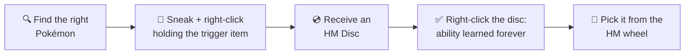

{ .hero-logo }

# Cobblemon Ditto HMs

Become the HM slave you always made suffer. **47 Pokopia-inspired abilities** — 33 active and 14
toggles — that *you* learn instead of teaching them to a Pokémon, paid for in hunger rather than a
party slot.

MC 1.21.1 Cobblemon 1.7.3 Fabric NeoForge

[Get started](getting-started.md){ .md-button }
[All 47 HMs](abilities/active.md){ .md-button }

## How it works

1. **Find the right Pokémon** in the wild — each ability is tied to one or more species.
2. **Sneak + right-click** that Pokémon while holding the required trigger item.
3. The Pokémon gives you an **HM Disc**.
4. **Right-click the HM Disc** to learn the ability permanently.
5. Press **H** for the **HM wheel** — every HM you know, nothing to craft and nothing to carry.

!!! tip "Discovery is part of the game"
    The game itself never tells you which Pokémon teaches an HM or what item to hold —
    that's a secret. **This wiki is the only place** the acquisition tables are written down.

---

## Downloads

Grab the file matching your loader — one version per loader, always:

- ⬇️ **[Modrinth](https://modrinth.com/mod/cobblemon-ditto-hms)**
- ⬇️ **[CurseForge](https://www.curseforge.com/projects/1587850)**

💛 Enjoying the mod? Consider [sponsoring shiero](https://github.com/sponsors/manucruzleiva) —
it keeps new HMs coming.

---

## Quick links

| | |
|---|---|
| [Getting Started](getting-started.md) | First steps and the HM wheel |
| [Active HMs](abilities/active.md) | 33 abilities you fire on demand |
| [Toggle HMs](abilities/toggles.md) | 14 passive abilities that run continuously |
| [HM Wheel](hm-wheel.md) | Pick any HM you know from one radial menu |
| [Configuration](configuration.md) | Per-ability hunger / cooldown / power sliders |
| [Commands](commands.md) | Admin and player commands |
| [Roadmap](roadmap.md) | What's coming in the next versions |
| [Community Credits](credits.md) | The people who shape the mod |

---

## Requirements

| Loader | Dependencies |
|---|---|
| **Fabric** | [Fabric Loader](https://fabricmc.net/) ≥ 0.16.5, [Fabric Language Kotlin](https://modrinth.com/mod/fabric-language-kotlin), [Cobblemon](https://modrinth.com/mod/cobblemon), [Cloth Config](https://modrinth.com/mod/cloth-config) |
| **NeoForge** | [NeoForge](https://neoforged.net/) 21.1+, [Kotlin for Forge](https://www.curseforge.com/minecraft/mc-mods/kotlin-for-forge) 5+, [Cobblemon](https://modrinth.com/mod/cobblemon) |
