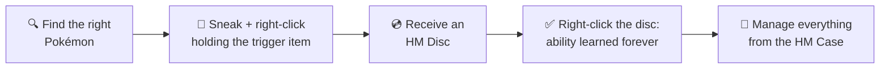

# Cobblemon Ditto HMs

  

**Cobblemon Ditto HMs** is a Minecraft 1.21.1 mod (Fabric & NeoForge) by **shiero** that brings
Ditto's **35 Pokopia HM abilities** (25 active + 10 toggles) into the Cobblemon experience.

---

## How it works

1. **Find the right Pokémon** in the wild — each ability is tied to one or more species.
2. **Sneak + right-click** that Pokémon while holding the required trigger item.
3. The Pokémon gives you an **HM Disc**.
4. **Right-click the HM Disc** to learn the ability permanently (it stays in your inventory as a usable badge).
5. Use your **HM Case** (craftable) to manage all learned abilities from a single hotbar slot.

!!! tip "Discovery is part of the game"
    The game itself never tells you which Pokémon teaches an HM or what item to hold —
    that's a secret. **This wiki is the only place** the acquisition tables are written down.

---

## Downloads

Grab the file matching your loader — one version per loader, always:

- ⬇️ **[Modrinth](https://modrinth.com/mod/cobblemon-ditto-hms)**
- ⬇️ **[CurseForge](https://www.curseforge.com/projects/1587850)**

💛 Enjoying the mod? Consider [sponsoring shiero](https://github.com/sponsors/manucruzleiva) —
it keeps new HMs coming.

---

## Quick links

| | |
|---|---|
| [Getting Started](getting-started.md) | First steps, crafting, and the HM Case |
| [Active HMs](abilities/active.md) | 24 abilities activated on right-click |
| [Toggle HMs](abilities/toggles.md) | 10 passive abilities that run continuously |
| [HM Case](hm-case.md) | Manage all abilities from one item |
| [Configuration](configuration.md) | Per-ability hunger / cooldown / power sliders |
| [Commands](commands.md) | Admin and player commands |
| [Roadmap](roadmap.md) | What's coming in the next versions |
| [Community Credits](credits.md) | The people who shape the mod |

---

## Requirements

| Loader | Dependencies |
|---|---|
| **Fabric** | [Fabric Loader](https://fabricmc.net/) ≥ 0.16.5, [Fabric Language Kotlin](https://modrinth.com/mod/fabric-language-kotlin), [Cobblemon](https://modrinth.com/mod/cobblemon), [Cloth Config](https://modrinth.com/mod/cloth-config) |
| **NeoForge** | [NeoForge](https://neoforged.net/) 21.1+, [Kotlin for Forge](https://www.curseforge.com/minecraft/mc-mods/kotlin-for-forge) 5+, [Cobblemon](https://modrinth.com/mod/cobblemon) |
