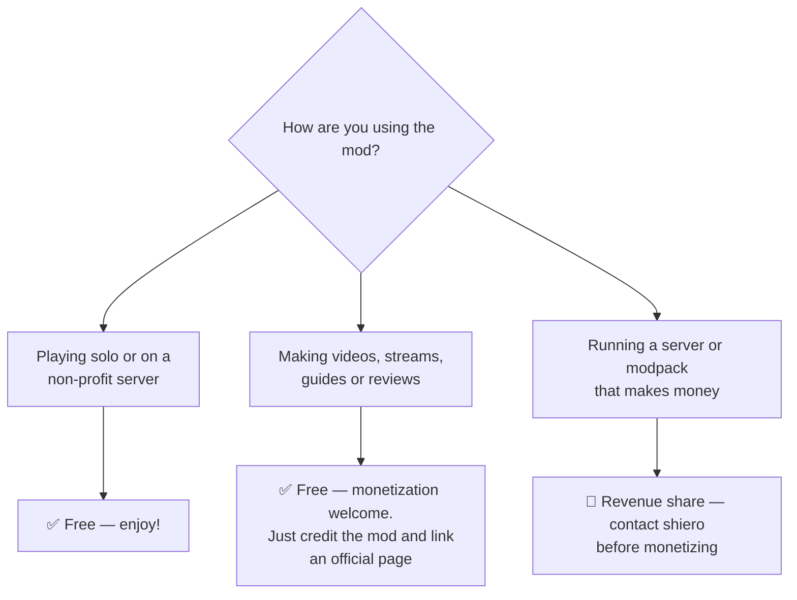

# License

Cobblemon Ditto HMs is **source-available with a revenue share** — the full terms live in the
project's `LICENSE` file; ask in [the Discord](https://discord.gg/SwcwXcCN4k) if you need a copy.
The short version:

## Personal use — free

Download, install and play — single-player or private, non-profit servers — with no restrictions,
as long as authorship is respected.

## Content creation — free, monetization welcome 🎥

Videos, livestreams, screenshots, reviews and guides about the mod are **encouraged**, including
monetized ones (ads, sponsorships, donations, memberships). The only condition: **credit the mod
by name and link an official project page** — [Modrinth](https://modrinth.com/mod/cobblemon-ditto-hms),
[CurseForge](https://www.curseforge.com/projects/1587850) or [this wiki](index.md).

## Commercial servers & paid modpacks — revenue share 💼

*"If you make money, I make money."* Any server or modpack generating revenue (ranks, VIP,
subscriptions, paid access…) while using the mod needs a revenue-sharing agreement — contact the
author **before** monetizing.

## Redistribution — not allowed

Do not re-upload the mod files to third-party sites or launchers. Download pages must point to
[the official sources](index.md#downloads).
