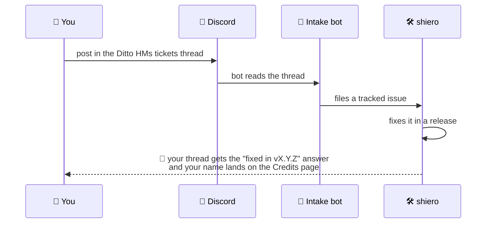

# 🐛 Reporting Bugs & Ideas

Found a bug? Have an idea for a new HM? Post it in [the Discord](https://discord.gg/SwcwXcCN4k) —
that's all you need to do. A bot picks it up from there and your report flows straight to the
developer.

## What makes a great bug report

- **Which HM**, and whether it was used as an **active** ability or a **toggle**.
- **What you did**, **what you expected**, **what happened** instead.
- The **mod version** (e.g. `1.1.1`), your **loader** (Fabric / NeoForge) and whether you're on a
  modpack.
- If the game crashed: attach the **crash report** (`crash-reports/` folder) or `latest.log`.

!!! tip "Hunger and cooldowns are configurable"
    Before reporting "this HM costs too much", check
    [Configuration](configuration.md) — every ability's hunger cost, cooldown and power is a
    server-side slider, so a modpack may have tuned it away from the defaults.

## Suggesting a new HM

New abilities are the most common request, and plenty on the [Roadmap](roadmap.md) started that
way. The ones that get built fastest describe:

- The **Pokémon move** it's based on, and what it does in the games.
- What it should **do in Minecraft** — the concrete, in-world effect.
- Whether it feels like an **active** (press to use, costs hunger) or a **toggle** (passive, blocks
  part of your hunger bar while on).

## What happens next

Every release automatically answers the reports it fixes — you'll see the version that shipped your
fix, and everyone who reported gets thanked on the [Community Credits](credits.md) page. 💚
