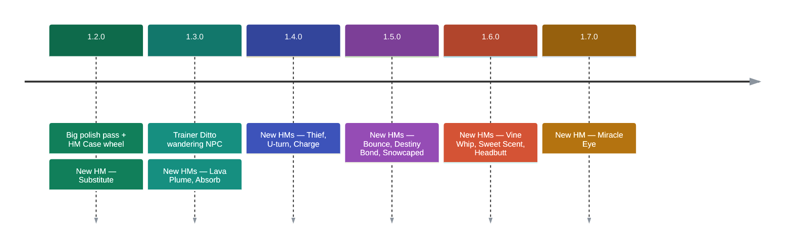

# Roadmap

Where Cobblemon Ditto HMs is heading. We add **new HMs a few at a time** so there's always
something fresh to discover — and polish the existing ones in between. Plans can shift as
development goes on; drop into [the Discord](https://discord.gg/SwcwXcCN4k) to weigh in — see
[Reporting Bugs & Ideas](../reporting.md).

<!-- Colores fijados a mano: ver la nota en routes/roadmap.md. La escala cScale de mermaid no sigue
     el tema de Material y en modo oscuro quedaba ilegible. -->

## 1.2.0 — Big polish + first new HMs

A large fix-and-feel pass across many HMs (Strength, Waterfall, Ember, Bullet Seed, Rain Dance,
Dig, Charm, Dive, Rock Climb, Glide and more), plus:

- **HM Case wheel** — press a key (default **H**) to open a Pokopia-style radial selector for your
  active HM and toggles; the management screen stays too.
- **Same-move teachers** *(optional)* — let any Pokémon that knows an HM's namesake move teach it.
- **Spawn with an HM Case** — new players start with the Case in hand.
- 🆕 **Substitute** — leave a decoy copy of yourself for a few minutes.

## 1.3.0 — A mysterious visitor

- **Trainer Ditto** — a rare wandering NPC that trades HM Discs for their trigger items. Rumour
  says it sometimes sparkles… and that a well-aimed Poké Ball reveals what it really is.
- 🆕 **Lava Plume** & 🆕 **Absorb** (a handy item-magnet).

## 1.4.0 — Utility HMs

- 🆕 **Thief**, 🆕 **U-turn**, 🆕 **Charge**.

## 1.5.0 — Movement & mischief

- 🆕 **Bounce**, 🆕 **Destiny Bond**, 🆕 **Snowcaped**.

## 1.6.0 — Nature's toolkit

- 🆕 **Vine Whip**, 🆕 **Sweet Scent**, 🆕 **Headbutt**.

## 1.7.0 — Miracle Eye

- 🆕 **Miracle Eye** — an Ender-Eye sense that points you toward legendary structures.

---

💛 Like where this is going? [Sponsoring shiero](https://github.com/sponsors/manucruzleiva) keeps
the HMs coming.
