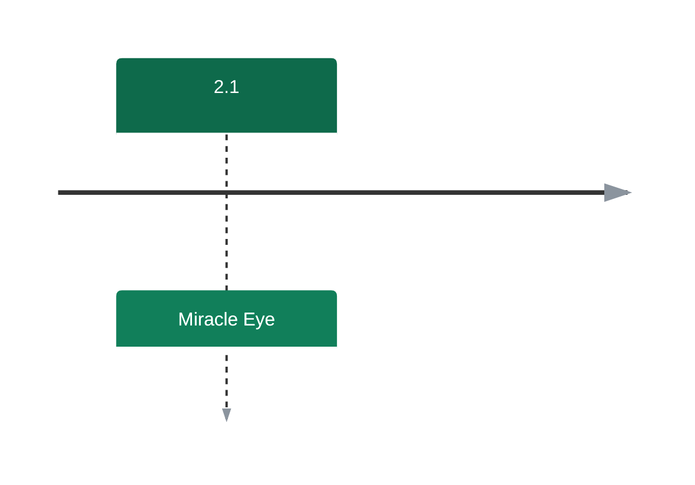

# Roadmap

Where Cobblemon Ditto HMs is heading. We add **new HMs a few at a time** so there's always
something fresh to discover — and polish the existing ones in between. Plans can shift as
development goes on; drop into [the Discord](https://discord.gg/SwcwXcCN4k) to weigh in — see
[Reporting Bugs & Ideas](../reporting.md).

<!-- Colores fijados a mano: ver la nota en routes/roadmap.md. La escala cScale de mermaid no sigue
     el tema de Material y en modo oscuro quedaba ilegible. -->

## 2.1 — Miracle Eye

- 🆕 **Miracle Eye** — an Ender-Eye sense that points you toward legendary structures.

---

💛 Like where this is going? [Sponsoring shiero](https://github.com/sponsors/manucruzleiva) keeps
the HMs coming.
