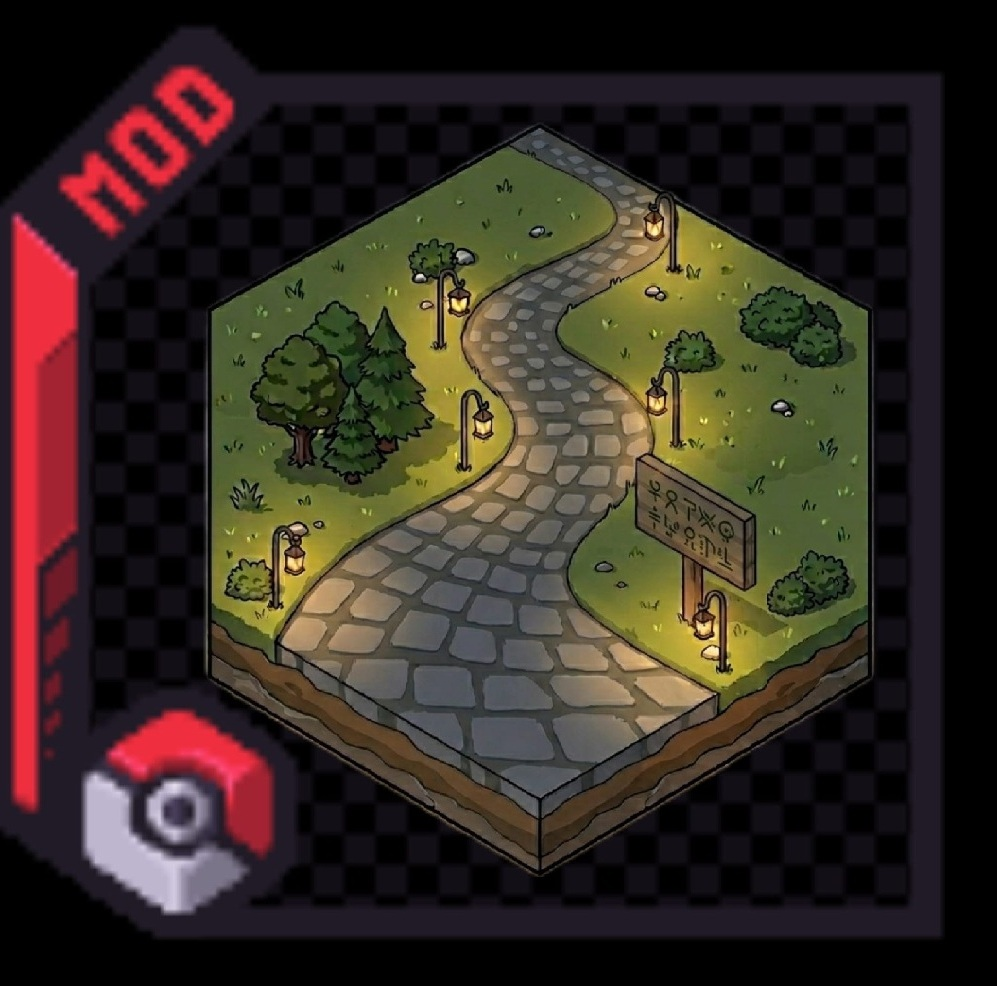
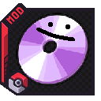

# Modding Wiki

Every Cobblemon mod by **shiero**, documented in one place.

Every page lives in **this** repository — one site, one build, one source of truth — with a section
per mod. The mod repos themselves are private; the documentation is not. This page is just the front
door.

Each section follows the same shape: **Getting Started**, then the mod's own feature pages, then
**Commands**, **Configuration**, **Reporting Bugs & Ideas**, **Roadmap**, **Community Credits** and
**License**.

## Pick a mod

-   [{ .mod-logo }](routes/index.md)

    ### [Cobblemon Routes](routes/index.md)

    Turn any Cobblemon world into a classic Pokémon-style RPG: auto-generated routes and towns,
    named capture areas, route trainers and full Xaero map integration.

    **MC 1.21.1 · Cobblemon 1.7.3 · Fabric + NeoForge**

-   [{ .mod-logo }](picnic/index.md)

    ### [Cobblemon Picnic](picnic/index.md)

    A picnic table that re-rolls nearby wild spawns on demand: hunt shinies or specific Pokémon
    without roaming. Also a social station with a shiny aura, Pokémon care and trainer battles.

    **MC 1.21.1 · Fabric + NeoForge**

-   [{ .mod-logo }](ditto-hms/index.md)

    ### [Cobblemon Ditto HMs](ditto-hms/index.md)

    Learn Ditto's 35 Pokopia HM abilities yourself — cut, fly, surf, teleport and more, fueled by
    hunger.

    **MC 1.21.1 · Fabric + NeoForge**

-   
🎲

    ### [Cobblemon Nuzlocke & Soul Link](nuzlocke/index.md) *(coming)*

    A full Hardcore Nuzlocke ruleset: one catch per zone, permadeath, mandatory nicknames, shiny
    clause, starter randomiser and level caps — plus **Soul Link**, the co-op mode where linked
    parties share fates.

    Still being split out of Routes. Until it ships, install **Cobblemon Routes** to get everything
    documented here.

## Reporting bugs and requesting features

Every mod has its own Discord forum channels, and a bot turns posts into GitHub issues
automatically. You don't need a GitHub account: post in the mod's forum and that's it.

The bots live in [`intake-bots`](https://github.com/manucruzleiva/intake-bots), one per project.

---

!!! info "This wiki replaces the old per-mod wikis"
    Each mod used to have its own wiki at its own URL (`cobblemon-routes-wiki`,
    `cobblemon-picnic-wiki`, `cobblemon-ditto-hms`). There is now a single one:
    **manucruzleiva.github.io/mod-wiki/**. Old links published on Modrinth and CurseForge should be
    updated.

!!! tip "Want to fix or improve a page?"
    Every page here lives in [this repository](https://github.com/manucruzleiva/mod-wiki) — the mod
    repos themselves are private, but the documentation is not. Open a pull request against
    `docs/<mod>/` and it goes live on merge.
