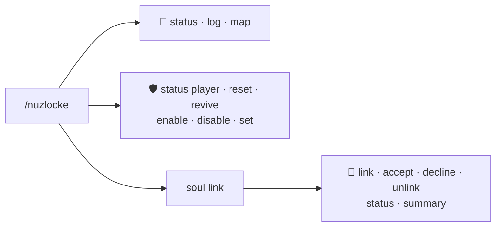
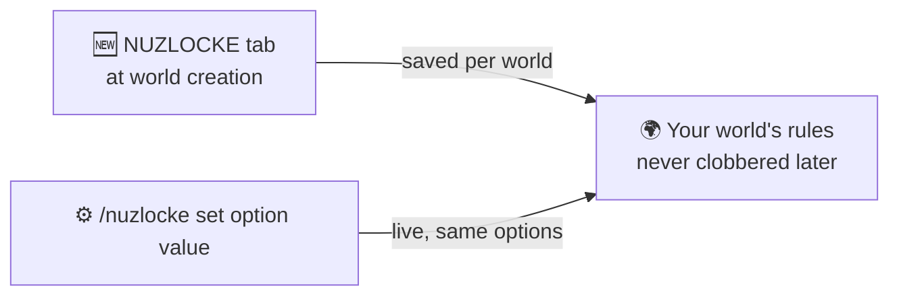

# ⌨️ Commands & Config

Everything under the **`/nuzlocke`** root, and every switch the ruleset has. Routes' road commands
live under [`/routes`](../routes/commands.md) — the two never mix.

👤 = every player · 🛡️ = operator (permission level 2)

## Quick reference

| Command | Who | One-liner |
| --- | :---: | --- |
| `/nuzlocke status [player]` | 👤 / 🛡️ | Zone records + party deaths (`[player]` is op-only). |
| `/nuzlocke log` · key **I** | 👤 | The run's log — the Soul Link log while you are in a link. |
| `/nuzlocke map` | 👤 | Dump your capture zones as map waypoints. |
| `/nuzlocke reset [player]` | 🛡️ | Clear a player's zone records and lift their game-over. |
| `/nuzlocke revive [player]` | 🛡️ | Revive a party's dead Pokémon. The mercy switch. |
| `/nuzlocke enable` · `disable` | 🛡️ | Master switch for this world, saved per world. |
| `/nuzlocke set <option> <value>` | 🛡️ | Change any single setting live. Tab-completes the names. |
| `/nuzlocke debug exp` | 🛡️ | Log what the level cap decides for each EXP gain. |
| `/nuzlocke soullink …` | 👤 | The co-op suite — see [Soul Link](soul-link.md). |

### `/nuzlocke soullink`

| Command | What it does |
| --- | --- |
| `link <player2> [player3] [player4]` | Offers a contract. Nothing binds until **everyone** accepts. |
| `accept` · `decline` | Answer an offer. The prompt also appears as a screen you cannot dismiss. |
| `unlink` | Dissolves **your** binds. |
| `status` | Lists your binds in chat, with ✝ marking the dead. |
| `summary` | The linked-teams screen: every member's full party, soulmates marked ⇄. |

Offering a link does not need the command — right-click a player and pick **Soul Link** from
Cobblemon's interaction wheel.

## Configuration

The ruleset is decided **when you create the world**, on a **NUZLOCKE** tab that sits next to
**GAME / WORLD / MORE**. Installing this add-on is what adds that tab; Routes' own generation options
live beside it on its [ROUTES tab](../routes/configuration.md).

Choices are stored **per world** and applied to new worlds only, so loading an existing world never
has its rules overwritten. Picking **Hardcore** at world creation turns the full ruleset on.

### The run

| Option | Default | Notes |
| --- | :---: | --- |
| Nuzlocke | on | master switch — off = a normal Cobblemon world |
| First-encounter lock | on | only the first wild per zone is catchable |
| Site encounters | on | structures grant one encounter per **kind** of site; off = none at all |
| Mandatory nicknames | on | the naming prompt |
| Whiteout | To Nearest City | what losing a battle does — city, Game Over, or nothing |
| Healing sources | ALL | ALL / MACHINES_ONLY / ITEMS_ONLY / NONE |
| No bag in battle | on | closes the battle bag |
| Battle bag blocks | Everything | Everything, or **Healing only** — X items stay legal either way |
| Above level cap → PC | on | over-cap catches are boxed (the cap itself comes from RCT) |
| Duplicates clause | evolution line | what counts as "already owned" |
| Egg clause | Encounter | the hatchling takes the zone it hatches in — or ban eggs, or exempt them |
| Defeated-catch window | 60 s | how long a beaten wild stays catchable — or off |
| Aggressive wilds | on | some species start a battle instead of meleeing you |
| Shared EXP | on | whole team gains EXP |
| EXP boost | x1 | x1 … x50, applies to the shared EXP too |
| PC only at the PC block | on | no remote PC access |

### Starters

| Option | Default | Notes |
| --- | :---: | --- |
| Starter selection | Mix | Normal / Random / Mix — Mix is a Grass, a Fire and a Water from three different generations, drawn from the real main-series starters |
| Starter level | 5 | 1–25 |
| No Legendaries · No Paradox · No Ultra Beasts | on | filters for the Random roll |
| No typical starters | off | excludes the pack's usual starters from Random |
| Shiny starter | Yes | No / Yes (normal odds) / Always |

### Gym Leader Challenge

| Option | Default | Notes |
| --- | :---: | --- |
| Gym Leader Challenge | on | offer every player a monotype run at character creation; off = never offered |

### Roads, towns and trainers

| Option | Default | Notes |
| --- | :---: | --- |
| Route trainers | on | needs a trainer mod; inert without one |
| Trainer entity ID | `rctmod:trainer` | which NPC to place |
| Trainer density | Medium | Low / Medium / High / Brutal — scales with route length |
| Trainer sight range | 15 | 0–64 blocks |
| Trainer field of view | 180° | the cone you must stand in to be challenged; 360 = they see behind them |
| One challenge gate | on | every challenge goes through this mod's guards; off = the trainer mod also challenges on its own, ignoring them |
| Always-aggressive trainers | `ltsurge` | ids that challenge on sight even though leaders normally wait |
| Challenge delay | 20 | ticks of "!" wind-up before the battle |
| Trainer skirmishes | on | trainers duel each other nearby |
| Fair-fight guard | on | a trainer far above your level never picks the fight |
| Max trainer level gap | 5 | 0–50 |
| Gyms beside towns | on | needs a gym pack |
| Gyms on the surface | on | lifts a gym whose own definition would bury it |

[Soul Link](soul-link.md#settings) has its own settings.
