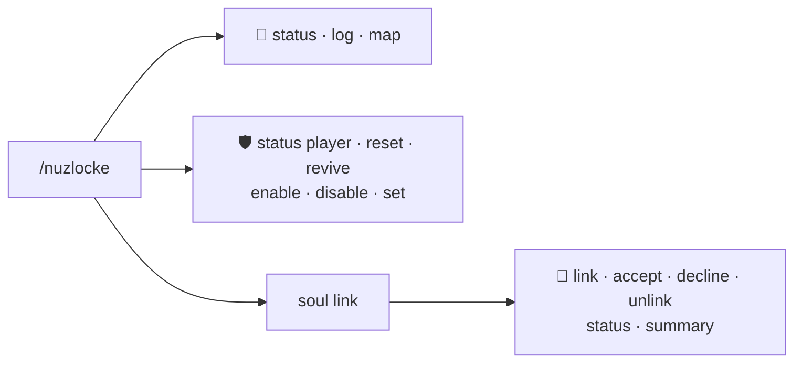

# ⌨️ Commands

Every command under the **`/nuzlocke`** root — the run itself and the co-op soul-link suite.

!!! tip "Routes has its own root"
    Routes' road commands live under [`/routes`](../routes/commands.md) — the two never mix.

👤 = every player · 🛡️ = operator (permission level 2)

## Quick reference

| Command | Who | One-liner |
| --- | :---: | --- |
| `/nuzlocke status [player]` | 👤 / 🛡️ | Zone records + party deaths (`[player]` is op-only). |
| `/nuzlocke log` · key **I** | 👤 | The visited-zones screen. |
| `/nuzlocke map` | 👤 | Dump your capture zones as map waypoints. |
| `/nuzlocke reset [player]` | 🛡️ | Clear a player's zone records. |
| `/nuzlocke revive [player]` | 🛡️ | Revive a party's dead Pokémon (lifts a game-over). |
| `/nuzlocke enable` · `/nuzlocke disable` | 🛡️ | Master switch for this world — turn the whole Nuzlocke ruleset on (routes-only when off) or off, saved per world. |
| `/nuzlocke set <option> <value>` | 🛡️ | Change any single per-world setting live — the same options as the create-world tab (e.g. `require_nicknames false`, `healing_mode ALL`). Tab-completes the names. |
| `/nuzlocke soullink …` | 👤 | The co-op soul-link suite (below). |

---

## 🧬 `/nuzlocke` — the run

### `status [player]` — 👤 (`[player]` 🛡️)
A chat summary of the run: zones visited (caught / failed / pending) and how many party members are
dead. Ops can inspect another player.

### `log` — 👤 · keybind **I**
Opens the **visited-zones screen**: every zone with its coordinates, the encounter's species, how
it went (✔ caught / ✘ lost / ● pending) and — for caught ones — whether that Pokémon is still
**♥ alive**, **✝ dead** or *(gone)*. The same screen opens with the **I** key (rebindable under
*Options → Controls*).

### `map` — 👤
Drops one waypoint per capture zone onto Xaero's map, named with its state symbol (● pending,
✔ captured, ✘ lost). Harmless without Xaero installed.

### `reset [player]` — 🛡️
Clears a player's zone records (their first-encounter history starts fresh) and lifts their
game-over flag. Admin/testing tool.

### `revive [player]` — 🛡️
Revives every **dead** Pokémon in the target's party and, if they were on a game-over, restores
survival mode. The mercy switch.

---

## ❤️‍🔥 `/nuzlocke soullink` — co-op contracts

See [Soul Link](soul-link.md) for the rules.

### `link <player2> [player3] [player4]` — 👤
Sends a **soul-link request** to up to three other players. Nothing links until **everyone
accepts** — souls are only shared by consent. Parties are linked slot by slot.

### `accept` / `decline` — 👤
Answer a pending request before it expires (timeout configurable, default 120 s).

### `unlink` — 👤
Dissolves **your** soul links. Groups left with fewer than two members dissolve entirely.

### `status` — 👤
Lists your soul links in chat — each group's Pokémon and owners, with ✝ marking the dead.

### `summary` — 👤
Opens the **linked-teams screen**: every soul-linked player (up to 4) with their full party —
nickname, species, level, HP, dead/alive — soul-linked Pokémon marked ⇄. Offline partners' teams
are included, loaded from storage.
