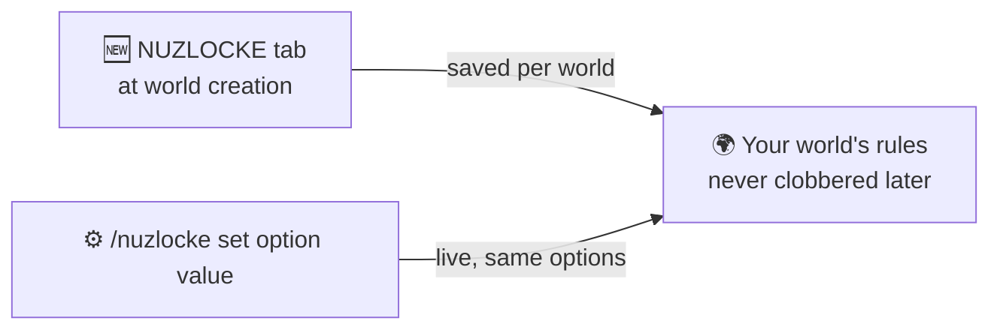

# 🧩 Configuration

The whole ruleset is decided **when you create the world**, on a dedicated **NUZLOCKE** tab that
sits next to **GAME / WORLD / MORE** on the create-world screen.

!!! warning "This tab ships inside Cobblemon Routes today"
    Until this mod is released separately, the NUZLOCKE tab is added by
    **[Cobblemon Routes](../routes/index.md)**. Routes' own generation options live on its
    [ROUTES tab](../routes/configuration.md).

## NUZLOCKE tab

Turn **Nuzlocke** on and the full ruleset comes with it — **permadeath**, **spectator on Game Over**
and forced **Hard** difficulty are all part of Nuzlocke, no separate toggles. The tab holds the rest:

| Option | Default | Notes |
| --- | --- | --- |
| Nuzlocke | on | master switch — off = a normal Cobblemon world |
| First-encounter lock | on | only the first wild per zone is catchable |
| Mandatory nicknames | on | `require_nicknames` — turn off the naming prompt |
| Healing sources | ALL | ALL / MACHINES_ONLY / ITEMS_ONLY / NONE |
| Above level cap → PC | on | over-cap catches boxed to the PC (follows RCT's cap) |
| Starter level | 5 | 1–25 |
| Shared EXP | on | whole team gains EXP |
| EXP during battle (per KO) | on | |
| EXP boost | x1 | x1 / x5 / x10 / x15 / x20 / x30 / x40 / x50 — applies to the whole-team share too |
| PC only at the PC block | on | blocks remote PC access in Nuzlocke worlds |

The **level cap itself is owned by Radical Cobblemon Trainers** — this mod does not define its own.

### Starter subsection

| Option | Default | Notes |
| --- | --- | --- |
| Starter selection | Mix | Normal / Random / Mix (Mix = one canonical starter per type, distinct gens) |
| No Legendaries | on | exclude Legendary / Mythical from the random / mix roll |
| No Paradox | on | exclude Paradox Pokémon |
| No Ultra Beasts | on | exclude Ultra Beasts |
| No typical starters | off | exclude the pack's usual starters from the RANDOM roll (Mix ignores it) |
| Shiny starter | Yes | No / Yes (normal odds) / Always (guaranteed) |

Soul Link has its own toggles too — see [Soul Link](soullock.md).

!!! info "Saved per world"
    Choices made in the tab are stored **per world** and only applied to a brand-new world —
    loading an existing world never gets its rules clobbered. Picking **Hardcore** at world
    creation auto-enables the full Nuzlocke rule set.

## Changing the rules later

Every option above can also be changed **live** with
[`/nuzlocke set <option> <value>`](commands.md), which tab-completes the option names — and the
whole ruleset can be switched off for the world with `/nuzlocke disable`.
