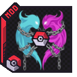

{ .hero-logo }

# Cobblemon Nuzlocke & Soul Link

A full **Hardcore Nuzlocke** the game enforces for you — one catch per zone, permadeath, mandatory
nicknames, level caps — so you play the run instead of policing yourself. And if you play with
friends, **Soul Link** binds your parties: when one linked Pokémon dies, so do its soulmates.

MC 1.21.1 Cobblemon 1.7.x Fabric NeoForge Requires Routes

[The ruleset](nuzlocke.md){ .md-button }
[Soul Link](soul-link.md){ .md-button }

!!! info "Installing"
    This is an **add-on for [Routes](../routes/index.md)** — the zones it locks onto are the routes,
    areas and towns Routes generates, so you need both. Grab it from
    [**Modrinth**](https://modrinth.com/mod/cobblemon-nuzlocke-soullink) or
    [**CurseForge**](https://www.curseforge.com/projects/1630816), for **Fabric** or **NeoForge** on
    Minecraft **1.21.1**.

    Alongside Routes it needs **[Cobblemon](https://modrinth.com/mod/cobblemon) 1.7.x**,
    **[Architectury API](https://modrinth.com/mod/architectury-api)** and
    **[Cloth Config](https://modrinth.com/mod/cloth-config)** — plus
    **[Fabric API](https://modrinth.com/mod/fabric-api)** on Fabric.

!!! note "Not to be confused with the *Cobblemon Nuzlocke* datapack"
    There is an unrelated [datapack by RRULE2001](https://modrinth.com/datapack/cobblemon-nuzlocke)
    with a similar name and goal. This is a different project — a **mod**, not a datapack — which is
    why this one carries *Soul Link* in its name.

## What it does

### [Hardcore Nuzlocke](nuzlocke.md) — works solo

- **First-encounter capture lock** — one catch per zone, and the zone is the route or area you are
  standing in.
- **Permadeath with heal-blocking** — a fainted Pokémon is gone, and you cannot heal your way out.
- **Mandatory nicknames** — every Pokémon you obtain gets named before you can use it.
- **Shiny clause** — a wild shiny is always catchable, no matter the encounter rule.
- **Starter randomiser** with filters for legendaries, paradox forms and Ultra Beasts.
- **Level caps**, EXP tuning, battle restrictions (Mega / Gigantamax / Z-Moves / Tera) and a
  configurable **Defeated-Catch window**.

### [Soul Link](soul-link.md) — co-op

Link parties with other players so your runs are bound together: when one linked Pokémon dies, so do
its soulmates. Includes a lone-combat block so nobody grinds ahead alone.

Soul Link is **optional** — it has its own toggle, and the whole Nuzlocke ruleset above works
perfectly well on a single-player world.

### What it puts in the world

- **Trainers along the roads** — they challenge you on sight and duel each other between fights.
- **A gym beside every town** you discover, instead of gyms generating lost in the wilderness.
  Needs a pack that provides gym structures, such as COBBLEVERSE.
- **The league as its own settlement** — one per world, out past the towns, with its own place on
  the map rather than sitting in somebody's home town.
- **The [Escape Rope](items.md)** — a craftable one-tap trip back to the nearest known town, which
  refuses to fire mid-battle.

## Zones come from Routes

The "one catch per zone" rule needs a definition of *zone*, and it takes it from
[Routes](../routes/index.md): the routes, areas and towns that Routes generates are the
capture zones. That is why this mod **depends on Routes** rather than shipping its own zone model.
