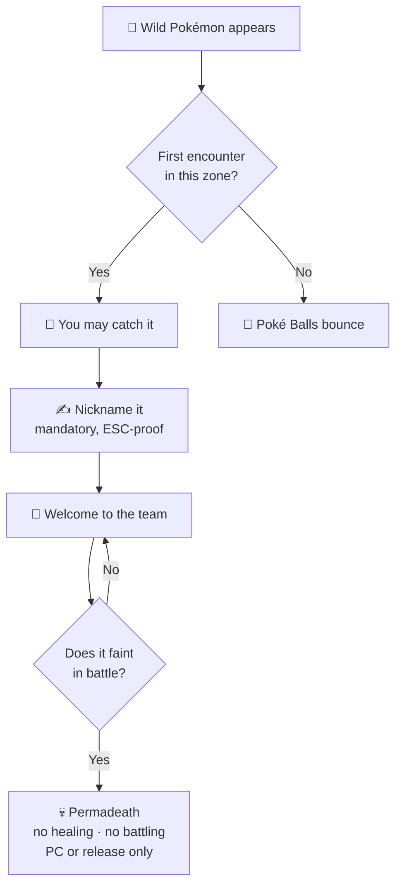

# 🎮 Hardcore Nuzlocke

The classic ruleset, enforced by the game instead of by your honour. Every rule below is a switch on
the **NUZLOCKE** tab at world creation, and every one of them can be changed later — see
[Commands & Config](commands.md).

## The rules

| Rule | What it means |
| --- | --- |
| 🎯 **One catch per zone** | Only the first wild you meet in a zone is catchable. A spent zone bounces Poké Balls, in battle and out. Fleeing or knocking the encounter out spends it just the same. |
| 💀 **Permadeath** | A fainted Pokémon is dead: no healing of any kind, no battling, no trading. The PC or release, nothing else. |
| ✍️ **Mandatory nicknames** | A blocking screen on every Pokémon you obtain, showing its sprite, gender, ability and moves — so you name it knowing what it is. |
| ✨ **Shiny clause** | A wild shiny is always catchable and never spends the zone. |
| 🔁 **Duplicates clause** | A Pokémon whose line you already own cannot be caught, and does not spend the zone — that encounter waits for something new. |
| 🥚 **Egg clause** | A hatchling is tied to where it **hatches**, like a wild catch. Eggs can also be banned outright, or exempted. |
| 😴 **Defeated Catch** | A wild you beat lies on the ground for a while, asleep at 1 HP and catchable — a second chance at the encounter, KO experience included. |
| 🏥 **Whiteout** | Losing a battle sends you to the **nearest city**. Running out of usable Pokémon anywhere is a Game Over. |
| 📈 **Level cap** | Follows your trainer card. Catches above it go straight to the PC, and nothing above it will pick a fight with you. |
| 🎒 **No bag in battle** | The battle bag is closed. A second mode blocks **only healing**, leaving X items legal — Poké Balls are never blocked. |

### Zones

A zone is a place, and the place decides the rule. Every **numbered Area**, every **named route**
and every **town** is its own capture zone. Everything not enclosed in an Area is a single shared
**Wild** zone, so growing the road network is what earns you new zones.

Structures are **sites**, and a site grants **one encounter per KIND of site**: your first pillager
outpost is an encounter, the next outpost is a place you have already spent. Site encounters can be
switched off entirely at world creation, in which case a structure counts as whatever surrounds it.

### The log

Press **I** (rebindable) for the run's record: every zone you have discovered, what you caught
there, and whether it is still alive. Your **starter** is in it, and so is anyone's
[Gym Leader Challenge](#gym-leader-challenge) type. In a [Soul Link](soul-link.md) it becomes the
link's log.

## 🎓 Gym Leader Challenge

One elemental type for the whole run. Your random starters are drawn from it, and you may only enter
a battle while **every Pokémon on your team** carries it.

- **Each player is asked at character creation**, and answers for themselves. Declining is one click.
  Server owners can switch the offer off for everyone.
- **Your type spawns more often** while the challenge runs — a thumb on the scale, not a filter.
- **An off-type catch still spends the zone.** The challenge decides what you may *use*, not how many
  tries you get. Off-type Pokémon go to the PC.

## What it builds into the world

-   ### ⚔️ Trainers on the roads

    They challenge you on sight and duel each other between fights — but only when it is fair: you
    are not already battling, they are off cooldown, the levels are close, and **you are in front of
    them**. Nothing challenges you from behind.

    A trainer in a battle cannot be killed, so the fight always resolves.

-   ### 🏛️ A gym beside every town

    Every town you discover gets its Gym Leader's gym next door, named after them. **Leaders wait to
    be challenged** — you walk in and ask. Lt. Surge is the exception.

    Needs a pack that provides gym structures, such as COBBLEVERSE.

-   ### 🏆 The Elite Four on a road

    One league per world, standing out on a route between settlements as a place of its own, with
    its own marker on the map.

-   ### 🧗 The Escape Rope

    A one-tap trip back to the nearest known town — and it will not fire mid-battle.

## 🧗 Escape Rope

Use it and you are whisked to the **nearest known town** on
[Routes'](../routes/index.md) network — and because every activated waystone registers as a town, it
works whether or not you run the Waystones mod.

| | |
| --- | --- |
| **Where it sends you** | the closest discovered town, on a safe dry column |
| **Restrictions** | Overworld only, never mid-battle, 10-second cooldown |
| **Cost** | one rope per use, free in creative |

No known town yet? The rope refuses and says so — go find a village or activate a waystone first.
And on a Nuzlocke run, refusing to fire mid-battle is the whole point: a fight you started is a fight
you finish.

### 🪢 Crafting

A **shapeless** recipe — the arrangement in the grid does not matter, the ingredients just have to be
in the table together. One craft makes **two**.

  

    

    

    

    

    

    

  

  
➜

  
2

| Ingredient | Amount |
| --- | :---: |
|  String | 2 |
|  Ender Pearl | 1 |
| **→  Escape Rope** | **2** |

## Just want the routes?

The whole ruleset stands down on demand and Routes keeps working — roads, waypoints and map paint
all intact. Set **Enable Nuzlocke** to off on the NUZLOCKE tab at world creation, or run
`/nuzlocke disable` on a world that already exists. To soften one rule instead of all of them, see
[Commands & Config](commands.md).
