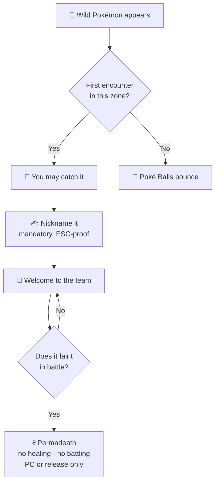

# 🎮 Hardcore Nuzlocke

Cobblemon Routes automates the classic Nuzlocke ruleset — no honor system needed. Everything is
enforced by the mod and configured per world from the **NUZLOCKE** tab.

!!! tip "Just want the routes? Turn Nuzlocke off"
    Cobblemon Routes works perfectly as a **routes-and-map mod with no Nuzlocke rules at all**.
    Turning Nuzlocke off keeps road generation, waypoints and the map paint fully working, and
    stands down the first-encounter lock, permadeath, whiteout, mandatory nicknames and the zone HUD.

    **Two ways to do it:**

    1. **When creating a world** — on the world-creation screen, open the **NUZLOCKE** tab and set
       **Enable Nuzlocke** to **Off**.
    2. **On a world that already exists** — an operator (permission level 2) runs:
       ```
       /nuzlocke enable false
       ```
       Turn it back on any time with `/nuzlocke enable true`. The choice is saved per world.

    **Prefer to keep Nuzlocke but soften one rule?** Every setting can be flipped individually — on
    the **NUZLOCKE** tab at world creation, or live in-game with `/nuzlocke set <option> <value>`
    (it tab-completes the names). For example, to stop the mandatory naming screen:
    ```
    /nuzlocke set require_nicknames false
    ```



## The rules

- **First-encounter lock per zone** — only the first wild Pokémon you meet in each zone is
  catchable. A spent zone bounces Poké Balls both in and out of battle; running away or knocking
  out the encounter spends the zone. Zones can be biomes, routes, or structures depending on the
  capture-zone mode you pick.
- **Permadeath** — a fainted Pokémon is permanently dead: no healing of any kind (machines, items,
  revives, sleeping), no battling, no trading. Only the PC or release. 🕯️
- **Mandatory nicknames** — a blocking naming screen on every Pokémon you obtain (catch, starter,
  egg, gift). Can be turned off with the `require_nicknames` option.
- **Defeated Catch** — a wild you defeat stays lying on the ground for a while, catchable but inert
  — a second chance at the encounter, and you still earn the KO experience.
- **Capture level cap** — follows your trainer-card cap, so you can catch anything up to the cap
  regardless of your current team's levels.
- **Modular healing** — choose what's allowed per world: everything, machines only, items only, or
  nothing at all.
- **Starters & EXP** — starter randomizer modes, configurable starter level, whole-team EXP share,
  mid-battle EXP per KO, and an EXP boost in discrete tiers (x1/x5/x10/x15/x20/x30/x40/x50) that also
  multiplies the whole-team share.
- **Hardcore extras** — optional forced Hard difficulty and PC access only at a real PC block.

!!! tip "Choose Hardcore at world creation"
    Picking **Hardcore** on the create-world screen auto-enables the full ruleset — see
    [World Creation & Config](/mod-wiki/routes/configuration/) for every option. Playing with
    friends? Try [Soul Link](soullock.md).
