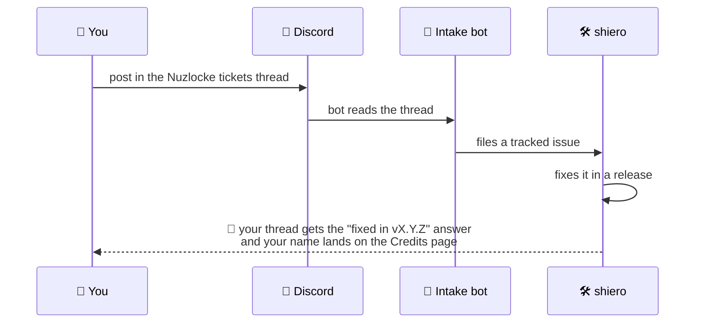

# 🐛 Reporting Bugs & Ideas

Found a bug? Have a feature idea? Post it in [the Discord](https://discord.gg/SwcwXcCN4k) — that's
all you need to do. A bot picks it up from there and your report flows straight to the developer.

!!! warning "Not released yet"
    Cobblemon Nuzlocke & Soul Link is still being split out of
    [Cobblemon Routes](../routes/index.md). Until it ships, the Nuzlocke and Soul Link rules run
    **inside Routes** — so if you hit a problem with them today, report it as a **Routes** issue and
    mention that it's about the Nuzlocke ruleset.

## What makes a great bug report

- **Which rule** misbehaved — one catch per zone, permadeath, nicknames, shiny clause, level caps,
  or a Soul Link pairing.
- **Where you were**: the zone name the mod showed you (a route, an area, a town, or the Wild).
- **What you did**, **what you expected**, **what happened** instead.
- The **mod version**, your **loader** (Fabric / NeoForge) and whether you're on a modpack.
- For Soul Link: **how many players** were linked and what each of them was doing at the time.
- If the game crashed: attach the **crash report** (`crash-reports/` folder) or `latest.log`.

!!! tip "Zone problems are usually Routes problems"
    "One catch per zone" is defined against Routes' zone model — the routes, areas and towns it
    generates **are** the capture zones. If the *zone itself* looks wrong (missing, badly shaped,
    oddly named), that's a Routes report, not a Nuzlocke one.

## What happens next

Every release automatically answers the reports it fixes — you'll see the version that shipped your
fix, and everyone who reported gets thanked on the [Community Credits](credits.md) page. 💚
