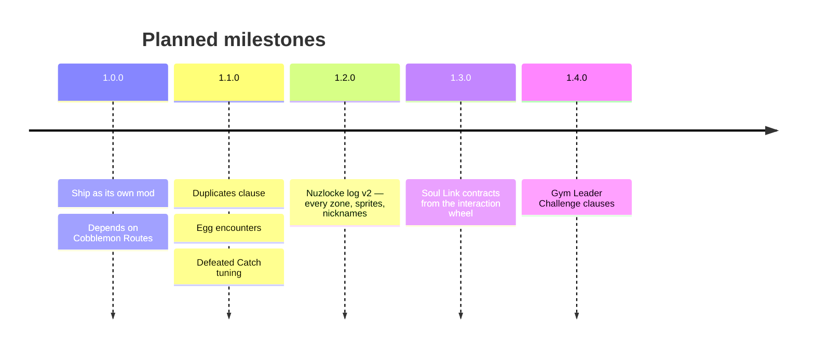

# Roadmap

Where Cobblemon Nuzlocke & Soul Link is heading. Plans can shift as development goes on — the
fastest way to weigh in is [the Discord](https://discord.gg/SwcwXcCN4k).

## 1.0.0 — Standing on its own

Today the Nuzlocke and Soul Link rules ship **inside [Cobblemon Routes](../routes/index.md)**.
The first milestone is simply to become a separate mod that depends on Routes, with no change in
behaviour for anyone already playing.

The boundary is deliberate and one-way: **Nuzlocke depends on Routes, never the reverse.** The
"one catch per zone" rule is defined against Routes' zone model — the routes, areas and towns
Routes generates *are* the capture zones — so the two can't be untangled the other way around.

## 1.1.0 — Rounding out the classic clauses

- **Duplicates clause** — a species you've already caught doesn't consume your encounter for the
  zone, so a fifth Rattata doesn't end your run's variety.
- **Egg encounters** — a clear rule for how hatched Pokémon count: whether they're free, whether
  they consume the zone's encounter, and what happens on a Soul Link.
- **Defeated Catch tuning** — the catch rate after defeating a Pokémon should feel like catching a
  **sleeping Pokémon at 1 HP**, rather than the flat rate it uses now.

## 1.2.0 — The Nuzlocke log, properly

A real log screen rather than a list: **every zone you've discovered**, what you caught there,
Pokémon **sprites** instead of names, and the **nicknames** you were forced to give — the run's
story in one place, including the graveyard.

## 1.3.0 — Soul Link contracts

Form and break Soul Link pairings from the **player interaction wheel** instead of a command, so
linking up with someone is a gesture in-world rather than typing.

## 1.4.0 — Gym Leader Challenge

An optional, harder layer on top of the Nuzlocke rules:

- A **setup screen** where you pick a type, which then drives a **randomised starter** of that type.
- A clause that only lets you **battle when your whole party matches the chosen type** — monotype
  runs with teeth.

---

💛 Like where this is going? [Sponsoring shiero](https://github.com/sponsors/manucruzleiva) keeps
the runs coming.
