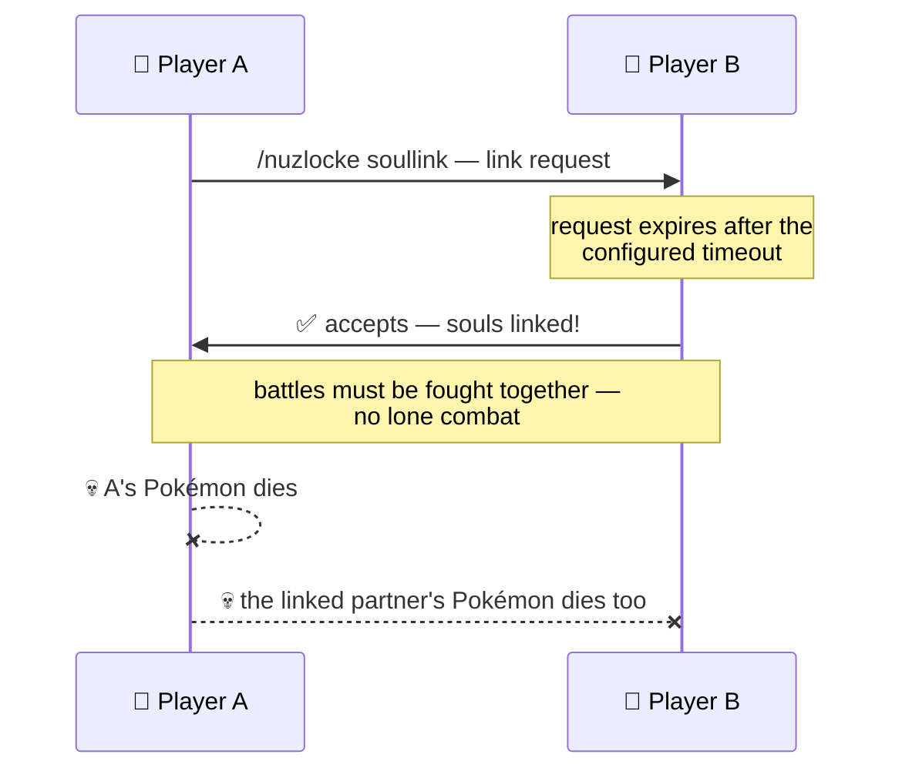

# ❤️‍🔥 Soul Link (co-op)

Soul Link is the cooperative Nuzlocke variant: you and your friends **link your souls** — from then
on you win together, and you lose together.

## How it works

- **Consented links** — a soul-link starts with a request (`/nuzlocke soullink`) that the
  other player must accept before it expires. Nobody gets linked against their will.
- **Shared death** — when a linked player's Pokémon dies, the partners' linked Pokémon die with it.
  Every loss is a team loss. 🕯️
- **No lone combat** — linked players fight together: battling without your soul partners nearby is
  blocked, keeping the run honest.
- **Group size** — up to the configured maximum (2–4 players).

## Configuration

| Option | Default | What it does |
| --- | --- | --- |
| `enable_soul link` | on | master toggle for the whole Soul Link system |
| `soul link_max_players` | 2 | maximum players in one soul-link (2–4) |
| `soul link_request_seconds` | 120 | how long a link request stays valid |

With Soul Link disabled, the linking command, the shared-death rule and the lone-combat block are
all turned off.

!!! tip
    Soul Link builds on the [Hardcore Nuzlocke](nuzlocke.md) rules — set both up from the same
    **NUZLOCKE** tab at world creation.
