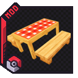

{ .hero-logo }

# Cobblemon Picnic

Spawn-hunting, made cozy. Place a **Picnic Table**, right-click it, and the wild Pokémon around you
are despawned and re-rolled into a fresh maximised spawn — hunt a shiny or a specific species
without walking the map raw. It doubles as a social station: shiny aura, Pokémon care and trainer
battles.

MC 1.21.1 Cobblemon 1.7.x Fabric NeoForge

[Get started](getting-started.md){ .md-button }
[Picnic tables](picnic-tables.md){ .md-button }

!!! info "Requirements"
    **Minecraft 1.21.1** · **Fabric or NeoForge** · **[Cobblemon](https://modrinth.com/mod/cobblemon) 1.7.x**.
    Fabric also needs **Fabric API** + **Fabric Language Kotlin**; NeoForge needs **Architectury API** +
    **Kotlin for Forge**. [Cloth Config](https://modrinth.com/mod/cloth-config)
    (+ [Mod Menu](https://modrinth.com/mod/modmenu) on Fabric) is **optional** — the in-game settings screen only.

## What can it do?

- :material-dice-multiple: **[Spawn re-rolling](spawn-rerolling.md)** — despawn wild Pokémon and
  force a fresh batch around you, on demand.
- :material-table-chair: **[Four table tiers](picnic-tables.md)** — Basic, Camping, Glamping, and
  the underwater-only Diving table.
- :material-star-four-points: **[Shiny aura](shiny-aura.md)** — sit together to raise shiny odds,
  with a particle ring and a HUD buff.
- :material-paw: **[Interactions & items](interactions-and-items.md)** — wash & play with Pokémon,
  store bread in baskets, bias spawns with snacks.
- :material-sword-cross: **[Battle Seeker](battle-seeker.md)** — a rare item that summons RCT
  trainers from a Glamping table.
- :material-console: **[Commands](commands.md)** & **[Configuration](configuration.md)** — full
  in-game tuning and live statistics.

## Get it

- **Download:** [Modrinth](https://modrinth.com/mod/cobblemon-picnic) (Fabric & NeoForge) ·
  [CurseForge](https://www.curseforge.com/projects/1581251)
- **Bugs & ideas:** report them in the community **Discord** — they're forwarded straight to the
  project's issue tracker.

New here? Start with **[Getting Started](getting-started.md)**.

---

!!! quote "License"
    Custom — **"If you make money, I make money."** Free to use and share for free; commercial use
    requires a revenue-share agreement with the author. Table/bench models & textures were adapted
    from **CobbleFurnies** and **Handcrafted**.
