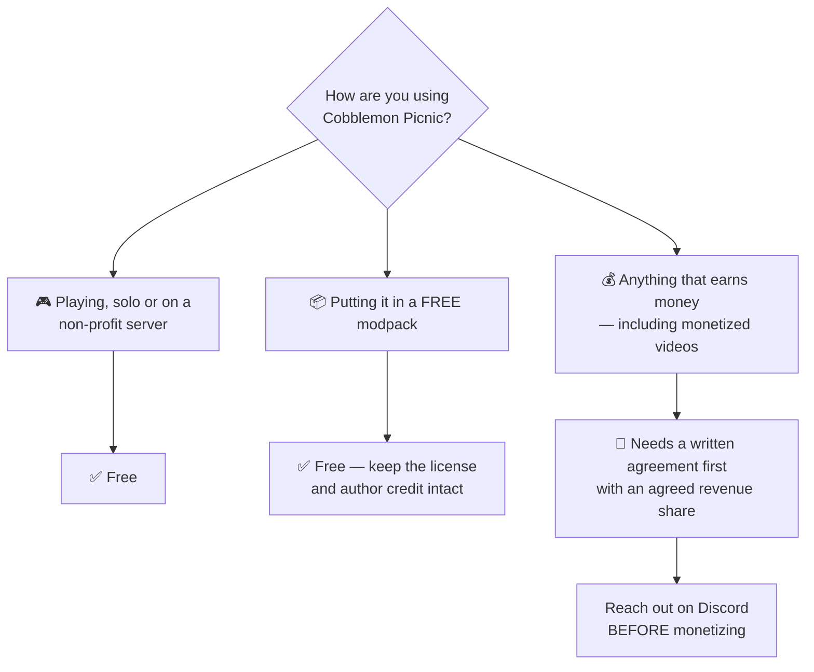

# 📜 License

Cobblemon Picnic ships under a **revenue-share license** by **shiero** — the short version: *if you
make money with this mod, the author makes money too.* The project's `LICENSE` file is the binding
document — ask in [the Discord](https://discord.gg/SwcwXcCN4k) if you need a copy. This page is
just the friendly summary.

## ✅ Free

- **Use, play and enjoy** the mod.
- **Include it in modpacks and redistribute it — for free**, as long as this license and author
  credit are kept intact.
- **Study and modify it** for personal, non-commercial use.

## 💰 Revenue-share: anything that earns money

If you earn money from this mod — or from any product, modpack, server, **video**, service or
distribution that **includes or depends on it** — the author is entitled to a fair share of that
revenue. The license names these explicitly:

- Paid modpacks.
- Paid server access or ranks tied to the mod.
- **Monetized content.**
- **Donations primarily driven by the mod.**

You must get in touch and **reach a written agreement on the revenue share before monetizing** —
[the Discord](https://discord.gg/SwcwXcCN4k) is the fastest way.

!!! warning "Creators: this mod is stricter than the others"
    Some of shiero's mods exempt monetized videos and streams outright. **Cobblemon Picnic does
    not** — its license counts monetized content and mod-driven donations as commercial use. If
    you're planning a monetized series around it, say hello first; agreements are friendly and
    quick, and the answer is usually yes.

## 🧩 Third-party assets

Some models and textures are derived from other mods — **CobbleFurnies** and **Handcrafted**. Those
assets remain subject to **their own original licenses**; this license covers only the original
Cobblemon Picnic code and content.

## ⚖️ No warranty

The software is provided *as is*, without warranty of any kind, express or implied. The author is
not liable for any damages arising from its use — see the project's `LICENSE` file for the exact
terms.
