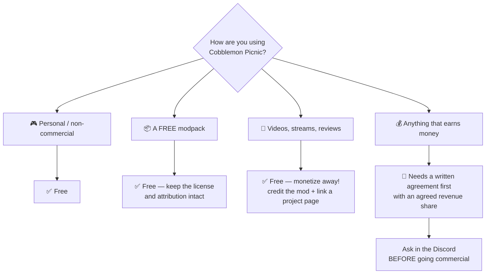

# 📜 License

Cobblemon Picnic ships under **one license shared by every mod shiero publishes**. Routes, Nuzlocke & Soul
Link, Picnic and Ditto HMs all carry the same `LICENSE` file, word for word — and it ships **inside
the jar**, so you always have a copy. The short version: *if you make money, shiero makes money.*
That file is the binding document; this page is the friendly summary.

!!! note "This mod used to be stricter — it is not any more"
    Cobblemon Picnic once counted monetized videos and mod-driven donations as commercial use. The
    unified license drops that: **content creation is free here too**, on the same terms as the
    other mods.
## 💬 One way to reach the author

Everything the license asks you to arrange happens in **[the Discord](https://discord.gg/SwcwXcCN4k)**.
There is no contact email — the server is the only channel, and it is where agreements get sorted
out fastest.

## 🎥 Creators: yes, and monetized is fine

Make videos, stream it, review it, write guides — **all free, all encouraged**, including
**monetized** content (ads, sponsorships, donations, memberships, even patron-exclusive series).
No agreement, no revenue share. The only ask: **credit the mod and link an official page**
([Modrinth](https://modrinth.com/mod/cobblemon-picnic), [CurseForge](https://www.curseforge.com/projects/1581251) or this wiki) in your description. Ask in the Discord if you want branding art for thumbnails — go
make it look good. 💛

## ✅ Free: personal, non-commercial, and free modpacks

Use it, copy it, modify it, share it — free of charge. Redistributing it **for free**, including
inside a free modpack, is explicitly allowed. Every copy and derivative has to keep the license
file and **clear attribution** to the original project.

## 💰 Revenue-share: commercial use

Anything that makes money off the **software itself** needs a **written agreement with the author
first**: selling the mod or derivatives, charging for access, downloads or hosting, bundling it in
a **paid modpack, server, product or service**, paid ranks or perks tied to it, or monetized
distribution. The agreement includes an agreed share of that revenue. (Content creation is exempt —
see above.)

Get in touch **before** any commercial use, in [the Discord](https://discord.gg/SwcwXcCN4k).

## 🏷️ Attribution

All copies and derivative works must credit the mod and its author, **shiero**, and link back to an
official project page.

## 🧩 Third-party assets

Some models and textures shipped with these mods derive from other projects — **CobbleFurnies** and
**Handcrafted**, in Cobblemon Picnic. Those assets stay under **their own original licenses**; this
license covers only the original code and content authored by shiero.

## ⚖️ No warranty

The software is provided *as is*, without warranty of any kind, express or implied. The author is
not liable for any damages arising from its use — see the `LICENSE` file for the exact terms.

!!! tip "Not sure which side you're on?"
    Playing on a private server with friends, or handing the pack to them for free: **free**.
    Charging players, donations-for-perks tied to the mod, or a paid pack that includes it: **ask
    in the Discord first** — agreements are friendly and quick, and the answer is usually yes.