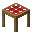
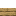
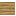
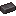

# Picnic Tables

Picnic Tables are the core block of the mod. Each is a **3×2 multiblock**: the **center column**
holds the **table cells** (re-roll + GUI), and the **side cells** are **benches** you can sit on, up
to the tier's seat cap. Leftover side cells stay empty.

## Tiers

| Tier | Spawn cap | Radius | Seats | Fuel / re-roll | Notes |
|------|:---------:|:------:|:-----:|:--------------:|-------|
| **Basic** | 5 | 32 | 2 | 7 bread | Entry tier |
| **Camping** | 8 | 48 | 3 | 5 bread | Cheaper fuel, bigger |
| **Glamping** | 12 | 64 | 4 | 3 bread | Unlocks the **[Battle Seeker](interactions-and-items.md#battle-seeker)** slot |
| **Diving** | 12 | 64 | 4 | 3 bread | **Placed underwater only** |
| **Hot** | 12 | 64 | 4 | 3 bread | At home in the **Nether** — the only table that survives there |
| **Strange** | 12 | 64 | 4 | 3 bread | At home in **the End** — the only table that stays put there |

- **Spawn cap** — the maximum Pokémon a single re-roll can spawn (and the GUI slider's max).
- **Radius** — how far around the table wild Pokémon are despawned and re-rolled.
- **Seats** — how many benches the footprint provides (seat counts are **fixed per tier**, not
  configurable).
- **Fuel** — bread consumed per re-roll, cheaper as tiers improve (7 for Basic, 5 for Camping, 3 for
  everything above). Bread comes from the table's fuel slot or from a nearby
  **[Picnic Basket](interactions-and-items.md#picnic-baskets)**. The per-tier cost is configurable
  (`fuelcost <tier>`).

**Basic → Camping → Glamping** is the ladder. **Diving**, **Hot** and **Strange** are three steps
sideways off the top of it: identical in what they do, different only in where they can go. See
[Where each table can go](#where-each-table-can-go).

## Crafting

A Picnic Table is built in two steps: craft the **three components**, then assemble them into the
**Basic Picnic Table**. Higher tiers are upgrades of that one.

### 1. The components

Each one comes in every color or wood the table can be built from — the grids below show one
example.

=== "Table"

    The tablecloth piece. Any of the **16 dye colors** of wool, over **oak planks**, gives that
    color's Table (*White Table*, *Red Table*, …).

    

    

      

        

        

        

        

        

        

        

      

      
➜

      

    

    

    | Ingredient | Amount |
    | --- | :---: |
    |  Wool — any of the 16 colors | 3 |
    |  Oak Planks | 2 |
    | **→  Table** in that color | **1** |

=== "Dining Bench"

    The seat. Slabs and planks of the **same wood** — available in **11 woods**: oak, spruce, birch,
    jungle, acacia, dark oak, mangrove, cherry, bamboo, crimson and warped.

    

    

      

        

        

        

        

        

        

        

      

      
➜

      
2

    

    

    | Ingredient | Amount |
    | --- | :---: |
    |  Slab — any of the 11 woods | 3 |
    |  Planks of the same wood | 2 |
    | **→  Dining Bench** in that wood | **2** |

=== "Picnic Basket"

    Apricorns over apricorn planks, in a 2×2 corner of the grid. One per apricorn color — white,
    black, blue, green, pink, red and yellow.

    

    

      

        

        

        

        

        

        

        

      

      
➜

      

    

    

    | Ingredient | Amount |
    | --- | :---: |
    |  Apricorn — any of the 7 colors | 2 |
    |  Apricorn Planks | 2 |
    | **→  Picnic Basket** in that color | **1** |

    A basket is also useful on its own, as a
    **[bread store](interactions-and-items.md#picnic-baskets)** next to the table.

### 2. The Basic Picnic Table

  

    

    

    

    

    

    

    

    

    

  

  
➜

  

| Ingredient | Amount | Accepts |
| --- | :---: | --- |
|  Picnic Basket | 1 | any of the 7 colors |
|  Vivichoke | 1 | — |
|  Table | 2 | any of the 16 colors — **the left one sets the tablecloth color** |
|  Campfire Pot | 1 | any Cobblemon Campfire Pot, or Cobblemon's own Campfire |
|  Dining Bench | 2 | any of the 11 woods — **the left one sets the frame wood** |
|  Campfire | 1 | Campfire *or*  Soul Campfire |
| **→  Basic Picnic Table** | **1** | |

The result renders in that exact **color × wood** combination, using the mod's **own models and
textures** (no other furniture mod required). The basket, pot and campfire are consumed but don't
change how the table looks. Every color/wood variant is also available in the Creative inventory.

### 3. Upgrading

The three higher tiers are **shapeless** — the ingredients can sit anywhere in the grid. An upgrade
**keeps the color and wood** the table was crafted with, so it stays the same style all the way up;
the bench you add is fuel for the recipe, not a new style, and its wood is ignored.

=== "Camping"

    

    

      

        

        

        

        

        

      

      
➜

      

    

    

    | Ingredient | Amount |
    | --- | :---: |
    |  Basic Picnic Table | 1 |
    |  Diamond | 1 |
    |  Dining Bench — any wood | 1 |
    | **→  Camping Picnic Table** | **1** |

=== "Glamping"

    

    

      

        

        

        

        

        

      

      
➜

      

    

    

    | Ingredient | Amount |
    | --- | :---: |
    |  Camping Picnic Table | 1 |
    |  Netherite Ingot | 1 |
    |  Dining Bench — any wood | 1 |
    | **→  Glamping Table** | **1** |

=== "Diving"

    

    

      

        

        

        

        

        

      

      
➜

      

    

    

    | Ingredient | Amount |
    | --- | :---: |
    |  Glamping Table | 1 |
    |  Heart of the Sea | 1 |
    | **→  Diving Picnic Table** | **1** |

=== "Hot"

    

    

      

        

        

        

        

        

      

      
➜

      

    

    

    | Ingredient | Amount |
    | --- | :---: |
    |  Glamping Table | 1 |
    |  Netherite Ingot | 1 |
    | **→  Hot Picnic Table** | **1** |

=== "Strange"

    

    

      

        

        

        

        

        

      

      
➜

      

    

    

    | Ingredient | Amount |
    | --- | :---: |
    |  Glamping Table | 1 |
    |  Eye of Ender | 1 |
    | **→  Strange Picnic Table** | **1** |

## Where each table can go

**Any table can be placed in any dimension.** Where a table goes is your business — what the place
does to it once it is standing there is the dimension's, and two of them do not take kindly to a
picnic. Each has one table that is at home in it and comes through untouched.

| Table | Overworld | Nether | The End |
|---|:---:|:---:|:---:|
| **Basic / Camping / Glamping** | ✅ | ⚠️ catches fire | ⚠️ drifts away |
| **Diving** | ✅ underwater only | ⚠️ catches fire | ⚠️ drifts away |
| **Hot** | ✅ | ✅ **at home** | ⚠️ drifts away |
| **Strange** | ✅ | ⚠️ catches fire | ✅ **at home** |

🔥 **An ordinary table burns in the Nether.** Leave any table but the **Hot** one down there and it
has a **30% chance every second** of a flame taking hold on one of its cells. Nothing is destroyed
outright — it burns from there under the normal fire rules, so you can still put it out. To picnic in
the Nether properly, bring the Hot table: it never catches fire.

🌌 **The End will not hold a picnic still.** Sit down at any table but the **Strange** one out there,
or try to re-roll at it, and the whole table is **somewhere else within 24 blocks** before the click
lands — leaving you standing where it used to be. Nothing is lost: the bread in the slot, the cloth
colour and bench wood it was crafted with, and your Pokémon-per-re-roll setting all travel with it. A
table with nowhere to go — walled in, or ringed by void — stays put and works normally. To picnic in
the End properly, bring the Strange table: it never drifts.

🌊 The **Diving** table is the same idea in water: it only deploys **submerged**, and won't place in air.

## Placement & orientation

The table **deploys in front of you**, with the **table column centred** on where you aim, oriented to
your facing — the "wide" axis runs left-to-right relative to you. The structure is one block tall:
benches on the sides, the functional table down the middle. All six cells must be free, and each table
needs its own footprint, since overlapping structures interfere with each other's cells.

**To pick it back up, break a bench.** Table cells take no mining damage — that's what keeps a re-roll
from destroying the table you're clicking. Breaking any bench takes the whole structure and returns
the table item.
