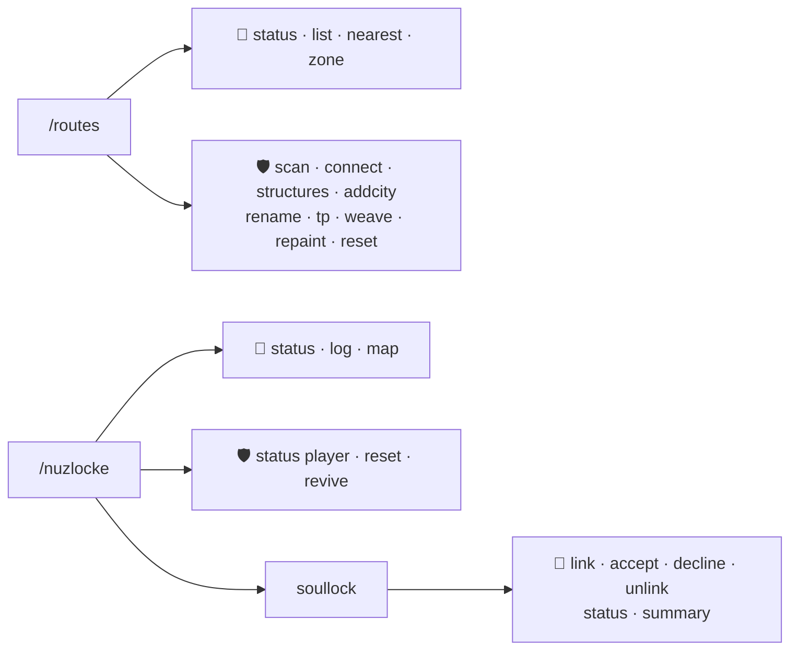

# ⌨️ Commands

The complete manual for every command. There are two roots — **`/routes`** for the road network and
**`/nuzlocke`** for the run.

👤 = every player · 🛡️ = operator (permission level 2)

## Quick reference

| Command | Who | One-liner |
| --- | :---: | --- |
| `/routes status` | 👤 | Network summary: towns, nodes, completed routes, queued edges. |
| `/routes list [cities\|routes]` | 👤 | Every known town / completed route, with coordinates. |
| `/routes nearest` | 👤 | Closest town and route, with distance and heading. |
| `/routes zone` | 👤 | What the chunk you stand in is painted as. |
| `/routes scan [radius]` | 🛡️ | Scan loaded chunks for city structures (1–100 chunks). |
| `/routes connect` | 🛡️ | Queue a road between the two nearest cities. |
| `/routes structures` | 🛡️ | Dump the structure-registry match report. |
| `/routes addcity [name]` | 🛡️ | Register where you stand as a named city. |
| `/routes rename <name>` | 🛡️ | Rename the nearest town. |
| `/routes tp <town>` | 🛡️ | Teleport to a named town. |
| `/routes weave [loops]` | 🛡️ | Force ring roads now (1–16). |
| `/routes repaint` | 🛡️ | Re-broadcast the map paint to everyone online. |
| `/routes reset` | 🛡️ | Wipe the roads and re-queue every connection. |
| `/nuzlocke status [player]` | 👤 / 🛡️ | Zone records + party deaths (`[player]` is op-only). |
| `/nuzlocke log` · key **I** | 👤 | The visited-zones screen. |
| `/nuzlocke map` | 👤 | Dump your capture zones as map waypoints. |
| `/nuzlocke reset [player]` | 🛡️ | Clear a player's zone records. |
| `/nuzlocke revive [player]` | 🛡️ | Revive a party's dead Pokémon (lifts a game-over). |
| `/nuzlocke enable` · `/nuzlocke disable` | 🛡️ | Master switch for this world — turn the whole Nuzlocke ruleset on (routes-only when off) or off, saved per world. |
| `/nuzlocke set <option> <value>` | 🛡️ | Change any single per-world setting live — the same options as the create-world tabs (e.g. `require_nicknames false`, `healing_mode ALL`). Tab-completes the names. |
| `/nuzlocke soullock …` | 👤 | The co-op soul-link suite (below). |

---

## 🛤️ `/routes` — the road network

### `status` — 👤
Prints the network at a glance: how many **towns** are known (and how many have real names), how
many **route nodes** were discovered, how many **routes are completed**, and how many **candidate
edges** wait in the build queue — then the first 16 routes with their endpoints.

### `list [cities|routes]` — 👤
The full inventory. `cities` lists every known town — its name (or *(unnamed town)*) and its `x, z`
coordinates; `routes` lists every completed route with its two endpoints. With no argument you get
both. Long lists are capped at 24 lines with an *"… and N more"* trailer.

### `nearest` — 👤
Where's civilization? Reports the **closest town** and the **closest route** to where you stand,
each with the distance in blocks and a compass heading (N, NE, E, …). Great when you're lost in
open wilderness.

### `zone` — 👤
The map-paint (and capture-zone) debugger: tells you what the **chunk you are standing in** is
painted as — a **CITY** (with its name), a **ROUTE** (name and endpoints), an enclosed **AREA**
(its `A#-Name`, or *unnamed until first entered*), or **open wilderness** (unpainted until your
network encloses it). Always agrees with the map colours and the zone pop-ups.

### `scan [radiusChunks]` — 🛡️
Scans the **already-loaded** chunks around you (default 8, up to **100** chunks radius) and
registers any city structures it finds as route nodes. Use after exploring somewhere new when you
don't want to wait for the automatic discovery.

### `connect` — 🛡️
Locates the nearest connectable cities from your position (seed-based — no chunk loading) and
queues a road between them. The road then builds incrementally.

### `structures` — 🛡️
Prints the structure-registry match report: which structure tags/ids from **Cities include** exist
in this world and what matched. The first stop when a structure type isn't being connected.

### `addcity [name]` — 🛡️
Registers **where you are standing** as a city node (default name `Gym`) and queues its road
connections. The escape hatch for places without a structure tag — player builds, modded
structures, anything.

### `rename <name>` — 🛡️
Renames the **nearest town within 160 blocks**. The new name shows in arrival banners, the Escape
Rope message and route endpoints; existing map waypoints refresh on rejoin.

### `tp <town>` — 🛡️
Teleports you to a **named** town (tab-completion suggests every real name), landing on the same
safe spot the Escape Rope uses. Wrong name? It points you at `/routes list cities`.

### `weave [loops]` — 🛡️
Runs the **ring-road pass right now**: up to `loops` (default 4, max 16) direct connections are
queued between towns that are close on the map but far apart by road. Every loop that completes
**encloses a new named AREA** — this is the fastest way to grow your capture zones.

### `repaint` — 🛡️
Re-broadcasts the chunk-paint geometry to every online player, forcing the Xaero overlays to
refresh without relogging.

### `reset` — 🛡️
⚠️ Wipes the **road records** and re-queues every connection from the known cities. Already-paved
blocks stay in the world; the network rebuilds its bookkeeping from scratch.

---

## 🧬 `/nuzlocke` — the run

### `status [player]` — 👤 (`[player]` 🛡️)
A chat summary of the run: zones visited (caught / failed / pending) and how many party members are
dead. Ops can inspect another player.

### `log` — 👤 · keybind **I**
Opens the **visited-zones screen**: every zone with its coordinates, the encounter's species, how
it went (✔ caught / ✘ lost / ● pending) and — for caught ones — whether that Pokémon is still
**♥ alive**, **✝ dead** or *(gone)*. The same screen opens with the **I** key (rebindable under
*Options → Controls → Cobblemon Routes*).

### `map` — 👤
Drops one waypoint per capture zone onto Xaero's map, named with its state symbol (● pending,
✔ captured, ✘ lost). Harmless without Xaero installed.

### `reset [player]` — 🛡️
Clears a player's zone records (their first-encounter history starts fresh) and lifts their
game-over flag. Admin/testing tool.

### `revive [player]` — 🛡️
Revives every **dead** Pokémon in the target's party and, if they were on a game-over, restores
survival mode. The mercy switch.

---

## ❤️‍🔥 `/nuzlocke soullock` — co-op contracts

See [Soul Link](/mod-wiki/nuzlocke/soullock/) for the rules.

### `link <player2> [player3] [player4]` — 👤
Sends a **soul-link request** to up to three other players. Nothing links until **everyone
accepts** — souls are only shared by consent. Parties are linked slot by slot.

### `accept` / `decline` — 👤
Answer a pending request before it expires (timeout configurable, default 120 s).

### `unlink` — 👤
Dissolves **your** soul links. Groups left with fewer than two members dissolve entirely.

### `status` — 👤
Lists your soul links in chat — each group's Pokémon and owners, with ✝ marking the dead.

### `summary` — 👤
Opens the **linked-teams screen**: every soul-linked player (up to 4) with their full party —
nickname, species, level, HP, dead/alive — soul-linked Pokémon marked ⇄. Offline partners' teams
are included, loaded from storage.

