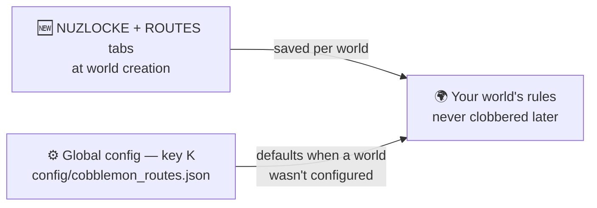

# 🧩 World Creation & Config

Everything is decided **when you create the world** — two dedicated tabs sit next to
**GAME / WORLD / MORE** on the create-world screen. Outside world creation there's a global config
screen for defaults.

## NUZLOCKE tab

Turn **Nuzlocke** on and the full ruleset comes with it — **permadeath**, **spectator on Game Over**
and forced **Hard** difficulty are all part of Nuzlocke, no separate toggles. The tab holds the rest:

| Option | Default | Notes |
| --- | --- | --- |
| Nuzlocke | on | master switch — off = a normal Cobblemon world |
| First-encounter lock | on | only the first wild per zone is catchable |
| Mandatory nicknames | on | `require_nicknames` — turn off the naming prompt |
| Healing sources | ALL | ALL / MACHINES_ONLY / ITEMS_ONLY / NONE |
| Above level cap → PC | on | over-cap catches boxed to the PC (follows RCT's cap) |
| Starter level | 5 | 1–25 |
| Shared EXP | on | whole team gains EXP |
| EXP during battle (per KO) | on | |
| EXP boost | x1 | x1 / x5 / x10 / x15 / x20 / x30 / x40 / x50 — applies to the whole-team share too |
| PC only at the PC block | on | blocks remote PC access in Nuzlocke worlds |

The **level cap itself is owned by Radical Cobblemon Trainers** — the mod no longer defines its own.

### Starter subsection

| Option | Default | Notes |
| --- | --- | --- |
| Starter selection | Mix | Normal / Random / Mix (Mix = one canonical starter per type, distinct gens) |
| No Legendaries | on | exclude Legendary / Mythical from the random / mix roll |
| No Paradox | on | exclude Paradox Pokémon |
| No Ultra Beasts | on | exclude Ultra Beasts |
| No typical starters | off | exclude the pack's usual starters from the RANDOM roll (Mix ignores it) |
| Shiny starter | Yes | No / Yes (normal odds) / Always (guaranteed) |

Soul Link has its own toggles too — see [Soul Link](../nuzlocke/soullock.md).

## ROUTES tab

Customise dynamic route generation for the world:

| Option | Default | Notes |
| --- | --- | --- |
| Generate routes | on | master switch |
| Road surface | Random (per route) | each route picks its own material, or fix one for every road |
| Road lamp posts | Random | Random / On / Off — Random decides per route |
| Tunnel lighting | Random | Random keeps some tunnels as dark caves |
| Underwater lighting | Random | sea lanterns along aquatic crossings |
| Routes per city | 2 | 1–5 roads out of each city |
| Ring roads | on | keep closing loops between nearby towns — loops enclose named areas |
| Gyms next to cities | on | each discovered city gets a gym beside it (needs a gym pack) |
| Cities include | Villages + BCA Villages | 16-entry checklist: fossils, ruins, outposts, pyramids… |
| Connect all structures | off | also connect non-city surface structures |
| Route trainers | on | trainers along finished roads |
| Trainer density | Medium | Low / Medium / High / Brutal — count scales with route length |
| Water crossings | Aquatic channel (always) | open channel + paved seabed underneath |

Route-trainer options (sight range, challenge delay, density, skirmishes) live under their own
**Route Trainers** heading. The map **tint intensity** (City / Route / Area, 0–100 %) is not a
world-creation choice — adjust it live from the sliders on
[Xaero's world map](map-integration.md) or in the config file.

!!! info "Saved per world"
    Choices made in these tabs are stored **per world** and only applied to a brand-new world —
    loading an existing world never gets its rules clobbered. Picking **Hardcore** at world
    creation auto-enables the full Nuzlocke rule set.

## Global defaults

The global defaults live in `config/cobblemon_routes.json` (English & Spanish labels) and are used
when a world wasn't configured through the tabs. The map-paint intensity also has live sliders on
[Xaero's world map](map-integration.md).

## Commands

The roots are `/routes` and `/nuzlocke` (the old `/cobblemonroutes …` still works everywhere).
The full manual — every command, argument, permission and behaviour — lives on
[the Commands page](commands.md).
