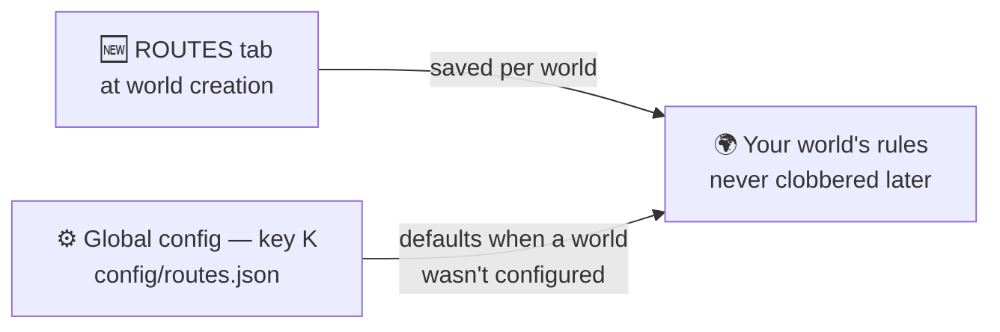

# 🧩 World Creation & Config

Everything is decided **when you create the world** — a dedicated **ROUTES** tab sits next to
**GAME / WORLD / MORE** on the create-world screen. Outside world creation there's a global config
screen for defaults.

!!! tip "Looking for the NUZLOCKE tab?"
    The Nuzlocke ruleset, its starter options and the Soul Link toggles belong to
    **[Cobblemon Nuzlocke & Soul Link](../nuzlocke/configuration.md)** — install that add-on and its
    tab appears next to this one.

## ROUTES tab

Customise dynamic route generation for the world:

| Option | Default | Notes |
| --- | --- | --- |
| Generate routes | on | master switch |
| Road surface | Random (per route) | each route picks its own material, or fix one for every road |
| Road lamp posts | Random | Random / On / Off — Random decides per route |
| Tunnel lighting | Random | Random keeps some tunnels as dark caves |
| Underwater lighting | Random | sea lanterns along aquatic crossings |
| Routes per city | 2 | 1–5 roads out of each city |
| Ring roads | on | keep closing loops between nearby towns — loops enclose named areas |
| Gyms next to cities | on | each discovered city gets a gym beside it (needs a gym pack) |
| Cities include | Villages + BCA Villages | 16-entry checklist: fossils, ruins, outposts, pyramids… |
| Connect all structures | off | also connect non-city surface structures |
| Route trainers | on | trainers along finished roads |
| Trainer density | Medium | Low / Medium / High / Brutal — count scales with route length |
| Water crossings | Aquatic channel (always) | open channel + paved seabed underneath |

Route-trainer options (sight range, challenge delay, density, skirmishes) live under their own
**Route Trainers** heading. The map **tint intensity** (City / Route / Area, 0–100 %) is not a
world-creation choice — adjust it live from the sliders on
[Xaero's world map](map-integration.md) or in the config file.

!!! info "Saved per world"
    Choices made in these tabs are stored **per world** and only applied to a brand-new world —
    loading an existing world never gets its rules clobbered. Picking **Hardcore** at world
    creation auto-enables the full [Nuzlocke rule set](../nuzlocke/configuration.md).

## Global defaults

The global defaults live in `config/routes.json` (English & Spanish labels) and are used
when a world wasn't configured through the tabs. The map-paint intensity also has live sliders on
[Xaero's world map](map-integration.md).

## Commands

The root is `/routes` (the old `/cobblemonroutes …` still works everywhere). The full manual — every
command, argument, permission and behaviour — lives on [the Commands page](commands.md).
