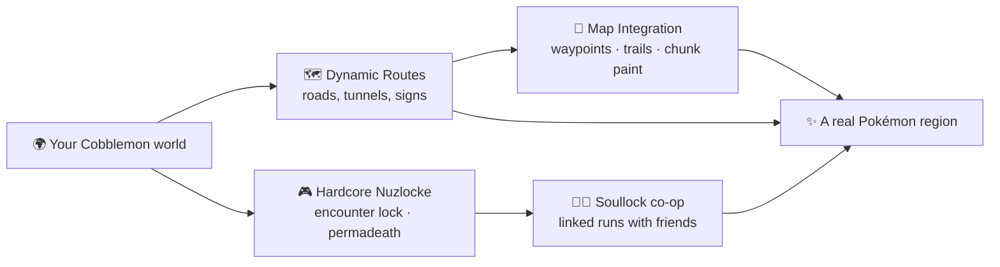

{ .hero-logo }

# Routes

Turn any Cobblemon world into a classic-style Pokémon region: **physical roads generated during
worldgen** that connect its cities and structures, named capture zones, and map integration that
ties it together. Works with any Cobblemon setup, and connects the gyms of packs like COBBLEVERSE
when they are present.

MC 1.21.1 Cobblemon 1.7.3 Fabric NeoForge

[Get started](getting-started.md){ .md-button }
[Commands](commands.md){ .md-button }

## Highlights

- 🗺️ **[Dynamic routes](routes.md)** between cities and structures, fully part of worldgen — roads
  seek flat ground, stay off the coast, tunnel mineshaft-style through mountains, and get names like
  *Route 3: Steep Forest Pass*.
- 🎮 **[Hardcore Nuzlocke](../nuzlocke/nuzlocke.md)** and ❤️‍🔥 **[Soul Link](../nuzlocke/soullock.md)**:
  per-zone encounter lock, permadeath and linked co-op runs. These belong to the
  **[Nuzlocke & Soul Link](../nuzlocke/index.md)** add-on — which ships inside this jar for now, so
  you get them either way. The zones they lock onto are the routes, areas and towns generated here.
- 🧭 **[Map integration](map-integration.md)** (optional): Waystones city nodes plus Xaero's
  waypoints, route trails and chunk painting.
- 🧗 **[Escape Rope](items.md)**: a craftable one-tap trip back to the nearest known town — works
  with or without Waystones.
- 🧩 **[World-creation tabs](configuration.md)**: dedicated **NUZLOCKE** and **ROUTES** tabs on the
  create-world screen — every rule set up-front, saved per world.

## Get it

Download for **Fabric** or **NeoForge** from [Modrinth](https://modrinth.com/mod/routes) or
[CurseForge](https://www.curseforge.com/projects/1584243), then see
[Getting Started](getting-started.md). Questions or ideas? Join [the Discord](https://discord.gg/SwcwXcCN4k).

!!! tip "💛 Enjoying the mod?"
    Routes is made by **shiero** in their free time. If it made your world more fun,
    consider [sponsoring shiero](https://github.com/sponsors/manucruzleiva) — it keeps the routes
    being built!

!!! note "License"
    Routes is **source-available with revenue share**: free for personal and
    non-commercial use with attribution; any revenue-generating use requires sharing revenue with
    the author. In short: *if you make money, shiero makes money.*
