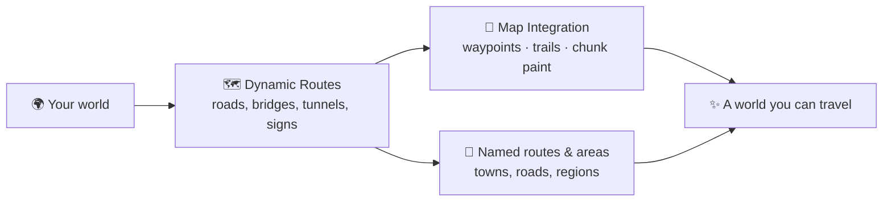

{ .hero-logo }

# Routes

Give your world a road network: **physical roads generated during worldgen** that connect its towns
and structures, named routes and areas, and map integration that ties it together. Roads are graded,
bridged and tunnelled to the terrain they cross, and every settlement they reach is one the game
really built.

MC 1.21.1 Fabric NeoForge

[Get started](getting-started.md){ .md-button }
[Commands](commands.md){ .md-button }

## Highlights

- 🗺️ **[Dynamic routes](routes.md)** between towns and structures, fully part of worldgen — roads are
  graded to the land, bridge the water, bore through what they cannot climb, share a trunk where they
  run together, and get names like *Route 3: Steep Forest Pass*.
- 🧭 **[Map integration](map-integration.md)** (optional): Waystones town nodes plus Xaero's
  waypoints, route trails and chunk painting.
- 🧩 **[World-creation tab](configuration.md)**: a dedicated **ROUTES** tab on the create-world
  screen — every rule set up-front, saved per world.
- 🎮 Playing a Pokémon world? **[Cobblemon Nuzlocke & Soul Link](../nuzlocke/index.md)** is a separate
  add-on that builds on this one: it locks encounters to the routes, areas and towns generated here,
  and adds the road trainers and the gyms beside towns.

## Get it

Download for **Fabric** or **NeoForge** from [Modrinth](https://modrinth.com/mod/routes) or
[CurseForge](https://www.curseforge.com/projects/1584243), then see
[Getting Started](getting-started.md). Questions or ideas? Join [the Discord](https://discord.gg/SwcwXcCN4k).

!!! tip "💛 Enjoying the mod?"
    Routes is made by **shiero** in their free time. If it made your world more fun,
    consider [sponsoring shiero](https://github.com/sponsors/manucruzleiva) — it keeps the routes
    being built!

!!! note "License"
    Routes is **source-available with revenue share**: free for personal and
    non-commercial use with attribution; any revenue-generating use requires sharing revenue with
    the author. In short: *if you make money, shiero makes money.*
