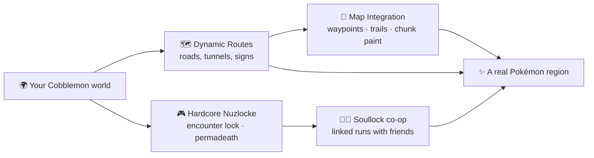

# Cobblemon Routes

{ width="160" align=right }

**Cobblemon Routes** is a **Cobblemon add-on** by **shiero** (Minecraft 1.21.1, Cobblemon 1.7.3)
that turns any Cobblemon world into a classic-style Pokémon RPG: **physical roads generated during
worldgen** that connect the world's cities and structures, automated **Hardcore-Nuzlocke** rules,
and map integrations that tie it all together. It works with any Cobblemon setup and is compatible
with packs like COBBLEVERSE (it connects their gyms when present).

## Highlights

- 🗺️ **[Dynamic routes](routes.md)** between cities and structures, fully part of worldgen — roads
  seek flat ground, stay off the coast, tunnel mineshaft-style through mountains, and get names like
  *Route 3: Steep Forest Pass*.
- 🎮 **[Hardcore Nuzlocke](/mod-wiki/nuzlocke/nuzlocke/)**: per-zone first-encounter lock, permadeath with
  heal-blocking, nicknames, Defeated Catch, and modular healing.
- ❤️‍🔥 **[Soul Link](/mod-wiki/nuzlocke/soullock/)**: consented soul-links with friends — shared destiny, shared death.
- 🧭 **[Map integration](map-integration.md)** (optional): Waystones city nodes plus Xaero's
  waypoints, route trails and chunk painting.
- 🧗 **[Escape Rope](items.md)**: a craftable one-tap trip back to the nearest known town — works
  with or without Waystones.
- 🧩 **[World-creation tabs](configuration.md)**: dedicated **NUZLOCKE** and **ROUTES** tabs on the
  create-world screen — every rule set up-front, saved per world.

## Get it

Download for **Fabric** or **NeoForge** from [Modrinth](https://modrinth.com/mod/cobblemon-routes) or
[CurseForge](https://www.curseforge.com/minecraft/mc-mods/cobblemon-routes), then see
[Installation](installation.md). Questions or ideas? Join [the Discord](https://discord.gg/SwcwXcCN4k).

!!! tip "💛 Enjoying the mod?"
    Cobblemon Routes is made by **shiero** in their free time. If it made your world more fun,
    consider [sponsoring shiero](https://github.com/sponsors/manucruzleiva) — it keeps the routes
    being built!

!!! note "License"
    Cobblemon Routes is **source-available with revenue share**: free for personal and
    non-commercial use with attribution; any revenue-generating use requires sharing revenue with
    the author. In short: *if you make money, shiero makes money.*
