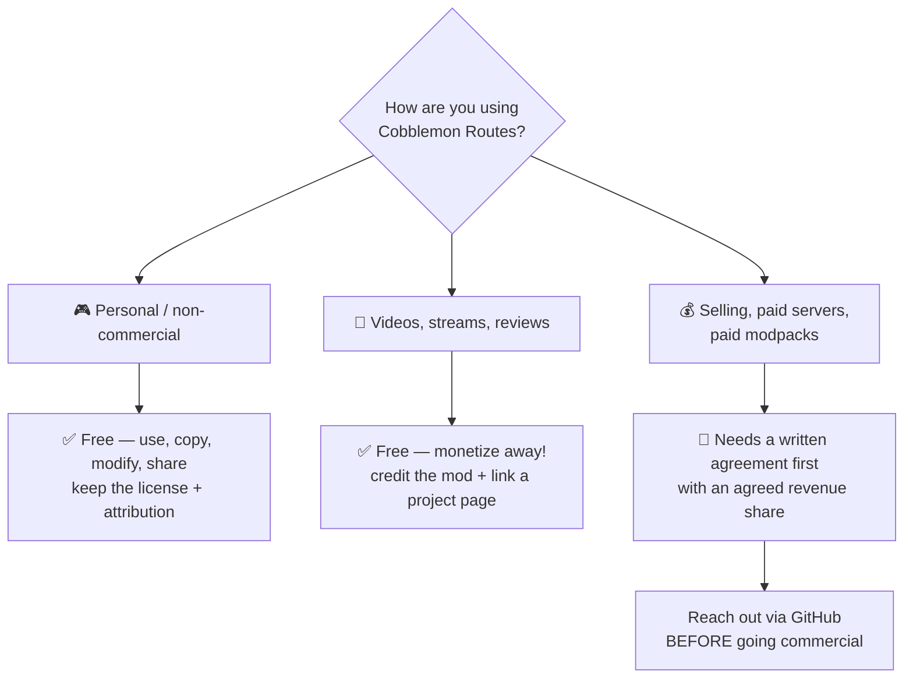

# 📜 License

Cobblemon Routes ships under a **revenue-share, source-available license** by **shiero** — the
short version: *if you make money, shiero makes money.* The full legal text lives in
[the LICENSE file](https://github.com/manucruzleiva/cobblemon-routes/blob/master/LICENSE), which is
the binding document; this page is just the friendly summary.

## 🎥 Creators: yes, and monetized is fine

Make videos, stream it, review it, write guides — **all free, all encouraged**, including
**monetized** content (ads, sponsorships, donations, memberships, even patron-exclusive series).
No agreement, no revenue share. The only ask: **credit Cobblemon Routes and link an official page**
([Modrinth](https://modrinth.com/mod/cobblemon-routes),
[CurseForge](https://www.curseforge.com/minecraft/mc-mods/cobblemon-routes) or this wiki) in your
description. Branding art for thumbnails lives in the repo's `art/branding/` — go make it look
good. 💛

## ✅ Free: personal & non-commercial

Use it, copy it, modify it, share it — free of charge — as long as every copy and derivative keeps
the license file and **clear attribution** to the original project.

## 💰 Revenue-share: commercial use

Anything that makes money off the **software itself** needs a **written agreement with the author
first** — selling the mod or derivatives, charging for access/downloads/hosting, bundling it in a
**paid modpack, server, product or service**, or monetized distribution. The agreement includes an
agreed share of that revenue. (Content creation is exempt — see above.)

Get in touch **before** any commercial use via
[the author's GitHub](https://github.com/manucruzleiva).

## 🏷️ Attribution

All copies and derivative works must credit **Cobblemon Routes** and link back to
[the original project](https://github.com/manucruzleiva/cobblemon-routes).

## ⚖️ No warranty

The software is provided *as is*, without warranty of any kind — see
[the LICENSE file](https://github.com/manucruzleiva/cobblemon-routes/blob/master/LICENSE) for the
exact terms.

!!! tip "Not sure which side you're on?"
    Running it on a private server with friends: **free**. Charging players, donations-for-perks
    tied to the mod, or a paid pack that includes it: **talk to shiero first** — agreements are
    friendly and quick.
