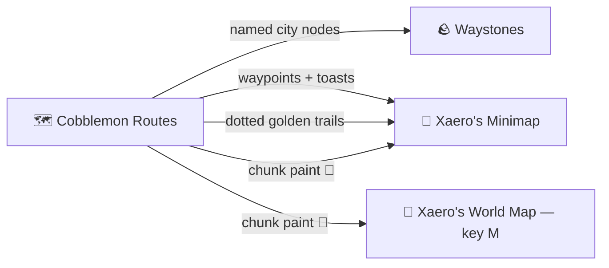

# 🧭 Map Integration

Cobblemon Routes talks to the maps you already use. Everything on this page is **optional** — the
mod detects what's installed and stays inert otherwise.

## Waystones

Activating a waystone registers it as a **named city** on the route network — your fast-travel
points become real places that roads connect to.

## Xaero's Minimap

- **Auto waypoints** — every named waystone you discover places a ground-level waypoint with a
  toast, and each **named town** drops its pin. Unnamed places are ignored (no spam). Routes are
  followed by their painted trail instead of markers.
- **Chunk paint** 🎨 — the `xaero_chunk_paint` option (default on) tints chunks on the map by
  **category**, with a subtle low-opacity wash: **magenta** over cities/villages, **orange** over
  routes, and **teal** over an area once it is **fully enclosed** by your cities and routes — open
  wilderness stays unpainted until the network grows around it. Enclosed areas earn a name
  (**A1, A2, …** with a nature flavour, e.g. "A3-Frostpine") shown by their entry pop-up.

## Xaero's World Map

The chunk paint also renders on the **full-screen World Map (key M)** — visible independently of
the minimap's Cave Mode and of your Y level, on the surface and in caves alike. The world map also
carries this mod's **control column** (top-left): a **Chunk paint** toggle for both maps, a
**Repaint map** button, and **three live intensity sliders** (City / Route / Area) that re-tint the
map in real time — 0 hides that category.

!!! note
    Get the map mods from [the Xaero's Minimap page](https://modrinth.com/mod/xaeros-minimap) and
    [the Waystones page](https://modrinth.com/mod/waystones) — then everything above just works.
