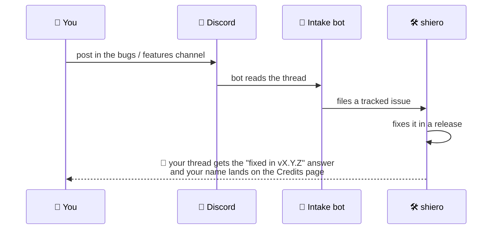

# 🐛 Reporting Bugs & Ideas

Found a bug? Have a feature idea? Post it in [the Discord](https://discord.gg/SwcwXcCN4k) — that's
all you need to do. A bot picks it up from there and your report flows straight to the developer.

## What makes a great bug report

- **What you did**, **what you expected**, **what happened** instead.
- The **mod version** (e.g. `0.76.0`), your **loader** (Fabric / NeoForge) and whether you're on a
  modpack.
- If the game crashed: attach the **crash report** (`crash-reports/` folder) or `latest.log`.

## What happens next

Every release automatically answers the reports it fixes — you'll see the version that shipped
your fix, and everyone who reported gets thanked on the
[Community Credits](credits.md) page. 💚
