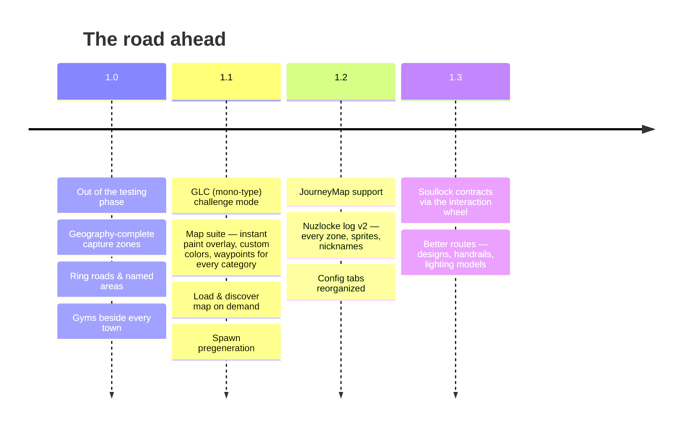

# 🧭 Roadmap

Where Cobblemon Routes is heading after 1.0. Everything below is tracked from
[the Discord](https://discord.gg/SwcwXcCN4k) — say what you want first, or
[suggest new ideas](reporting.md).

## 1.1 — the challenge & map update

- **GLC challenge mode** — a type-selection start (your chosen type drives random starters) and the
  clause that you may only battle while your whole team matches that type.
- **Chunk paint as a true overlay** — the map toggle shows/hides the paint instantly, no reload.
- **Pick your own colors** — per-category (city / route / area) color choice on the map menu,
  matched by the waypoint markers so paint and pins always combine.
- **Waypoints for everything** — automatic markers for cities, routes AND named areas.
- **Load & discover map** — a button that loads a chosen number of chunks around you so the map
  fills in on demand (with a resource-cost warning before it starts).
- **Spawn pregeneration** — start new worlds with a circle of chunks already generated, so your
  adventure begins with towns and routes on the map.

## 1.2 — more maps, a richer log

- **JourneyMap support** — the chunk paint and waypoints, mirrored on JourneyMap for players who
  prefer it over Xaero's.
- **Nuzlocke log v2** — every discovered city, route and area listed even before its encounter (a
  true region checklist), rendered with **sprites and icons** instead of text rows, and showing your
  Pokémon's **nicknames**.
- **World-creation tabs, reorganized** — a full pass over the NUZLOCKE and ROUTES tabs so every
  option sits on the right tab, under clear sub-sections.

## 1.3 — contracts & prettier roads

- **Soullock contracts on the interaction wheel** — link souls with a friend straight from the
  player interaction menu, no commands.
- **Better routes** — more road designs, **handrails** on some routes (cliffs and steep stretches
  especially), and a wardrobe of **lighting models** beyond the classic lamp post, all rolled
  per route so every road keeps its own personality.

!!! tip "Something missing?"
    The roadmap grows from player feedback — the fastest way to shape it is
    [reporting ideas](reporting.md) on the Discord or the tracker.
