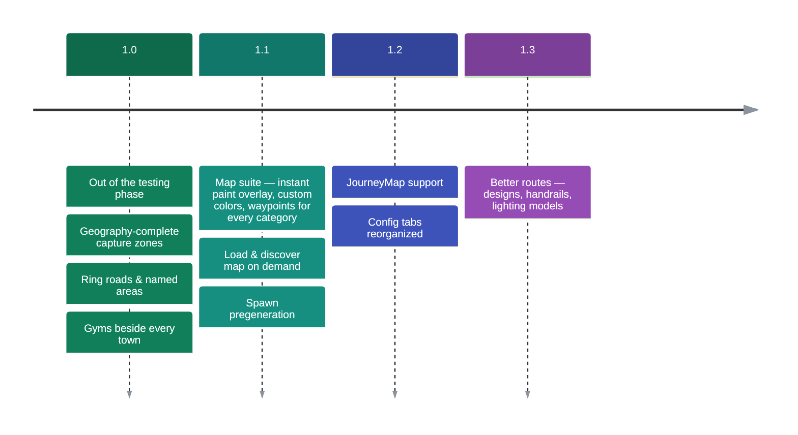

# 🧭 Roadmap

Where Routes is heading after 1.0. Everything below is tracked from
[the Discord](https://discord.gg/SwcwXcCN4k) — say what you want first, or
[suggest new ideas](../reporting.md).

<!-- Los colores van fijados a mano: `timeline` pinta sus cajas con la escala cScale de mermaid, que
     NO sigue el tema de Material — quedaban pasteles con texto claro encima, ilegibles en modo
     oscuro. Estos seis tonos tienen contraste >= 5:1 contra el blanco de las etiquetas y funcionan
     sobre fondo claro y oscuro por igual. El `title` se saco: lo dibuja en un gris que se pierde en
     los dos temas, y el H1 de la pagina ya dice lo mismo. -->

!!! info "Nuzlocke features have their own roadmap"
    The Nuzlocke log, the Soul Link contracts and the Gym Leader Challenge belong to
    **[Cobblemon Nuzlocke & Soul Link](../nuzlocke/roadmap.md)** and are planned there.

## 1.1 — the map update

- **Chunk paint as a true overlay** — the map toggle shows/hides the paint instantly, no reload.
- **Pick your own colors** — per-category (city / route / area) color choice on the map menu,
  matched by the waypoint markers so paint and pins always combine.
- **Waypoints for everything** — automatic markers for cities, routes AND named areas.
- **Load & discover map** — a button that loads a chosen number of chunks around you so the map
  fills in on demand (with a resource-cost warning before it starts).
- **Spawn pregeneration** — start new worlds with a circle of chunks already generated, so your
  adventure begins with towns and routes on the map.

## 1.2 — more maps

- **JourneyMap support** — the chunk paint and waypoints, mirrored on JourneyMap for players who
  prefer it over Xaero's.
- **World-creation tabs, reorganized** — a full pass over the create-world tabs so every option sits
  on the right tab, under clear sub-sections.

## 1.3 — prettier roads

- **Better routes** — more road designs, **handrails** on some routes (cliffs and steep stretches
  especially), and a wardrobe of **lighting models** beyond the classic lamp post, all rolled
  per route so every road keeps its own personality.

!!! tip "Something missing?"
    The roadmap grows from player feedback — the fastest way to shape it is
    [reporting ideas](../reporting.md) on the Discord or the tracker.
