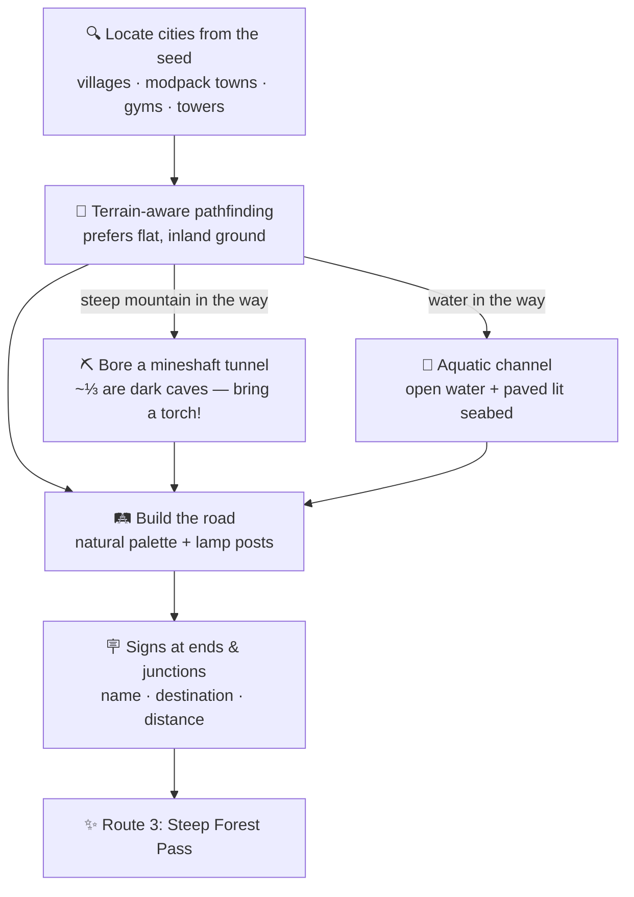

# 🗺️ Dynamic Routes

Cobblemon Routes grows a **road network through your world during worldgen** — no commands, no
walking the area first. Cities are found from the world seed, connected with terrain-aware paths,
and every road is signposted and named.

## What you get

- **Automatic road network** between cities — vanilla villages, modpack villages, Gimmighoul
  towers, gyms, and any structure you list. Built incrementally and resumed after a restart.
- **Flat & inland paths** — the pathfinder strongly penalises slopes and keeps a buffer away from
  shorelines, while still crossing water when there's no alternative.
- **Mineshaft tunnels** — when a climb is too steep (or there's no surface path at all), the route
  bores a clean, walkable, oak-framed tunnel instead of an impassable cliff. About a third of
  tunnels are atmospheric **dark caves** — bring torches!
- **Descriptive route names** — every road gets a code plus an auto-generated name from the terrain
  it crosses (*Route 5: Coastal Road*, *Route 8: Marsh Crossing*), always the same for your seed.
- **Clean tree clearing** — a road crossing a tree removes the whole trunk and canopy; no floating
  leaves, no item spam.
- **Water crossings** — navigable lit channels with natural rock markers: the water stays open to swim
  through while the seabed is paved and lit, so a submerged route runs beneath the surface one. Frozen
  lakes are crossed *under* the ice, never paved over it.
- **Signs everywhere** — directional signs at each end and at junctions, with plaza-paved crossings
  that stand out from the road.
- **Route trainers** — trainers appear along finished roads, ready to battle (they respect
  cooldowns and won't pester you twice).
- **Spawn in a city** — new worlds start next to the nearest city, never in the water.

!!! tip "Tune it per world"
    Roads per city, trainer density, water-crossing style and more are all set from the **ROUTES**
    tab at world creation — see [World Creation & Config](configuration.md).
